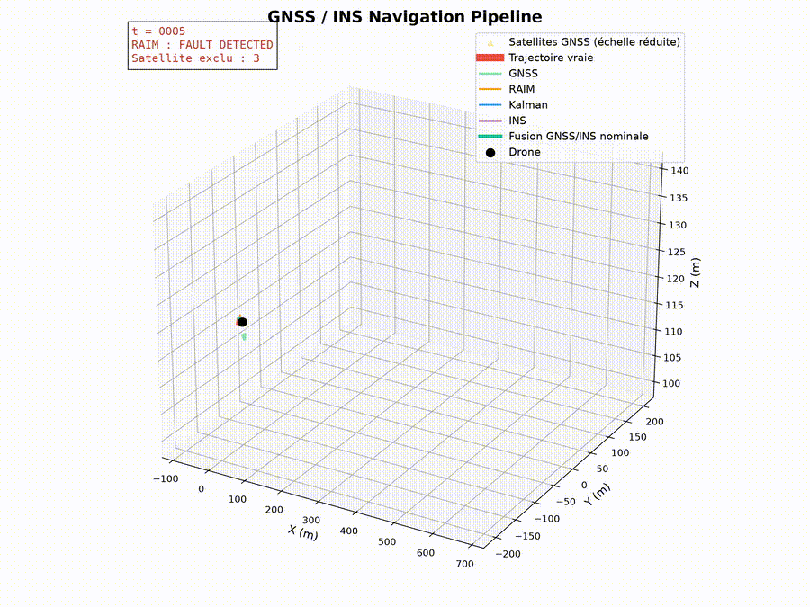

# Simulateur de Navigation Intégrée GNSS/INS

> **Projet de recherche et développement (R&D)** consacré à la conception d'une chaîne complète de navigation intégrée combinant un système de positionnement par satellites (GNSS) et une centrale inertielle (INS). L'objectif est de reproduire, dans un environnement de simulation maîtrisé, les principaux algorithmes utilisés dans les systèmes de navigation modernes afin d'étudier leur fonctionnement, leurs performances et leurs limites.

---

# 1. Introduction

La navigation est au cœur de nombreuses applications modernes : drones autonomes, véhicules terrestres, robots mobiles, aéronautique, spatial, maritime ou encore défense. Quel que soit le domaine considéré, un système de navigation doit répondre à plusieurs exigences fondamentales :

- fournir une position précise ;
- estimer correctement la vitesse du véhicule ;
- déterminer son orientation ;
- rester robuste face aux perturbations de l'environnement ;
- garantir la continuité du service même lorsque certaines mesures deviennent indisponibles ou erronées.

Aucune technologie ne permet aujourd'hui de satisfaire seule l'ensemble de ces exigences.

Le système GNSS (Global Navigation Satellite System) fournit une position absolue très précise à partir de satellites en orbite. Cependant, cette précision dépend fortement de la qualité des signaux reçus. Les mesures GNSS peuvent être dégradées par le bruit, le multipath, les masques urbains, les erreurs atmosphériques ou encore les défaillances d'un satellite. Dans certaines situations, le GNSS peut devenir momentanément indisponible.

À l'inverse, une centrale inertielle (INS – Inertial Navigation System) ne dépend d'aucune infrastructure extérieure. À partir des mesures d'accélération et de vitesse angulaire fournies par une IMU (Inertial Measurement Unit), elle estime en permanence la position, la vitesse et l'attitude du véhicule. Cette autonomie constitue son principal avantage. En revanche, toute erreur présente dans les capteurs inertiels est intégrée au cours du temps, provoquant une dérive progressive de la solution de navigation.

Ces deux technologies possèdent donc des caractéristiques complémentaires :

| GNSS | INS |
|------|-----|
| Position absolue | Position relative |
| Très bonne précision à long terme | Très bonne continuité temporelle |
| Dépend des satellites | Fonctionne sans infrastructure extérieure |
| Sensible aux perturbations radio | Sensible aux dérives des capteurs |

Les systèmes de navigation modernes reposent donc sur la **fusion GNSS/INS**, qui consiste à exploiter simultanément les avantages de ces deux familles de capteurs. Le GNSS corrige progressivement la dérive de la centrale inertielle tandis que l'INS assure une estimation continue lorsque les mesures GNSS deviennent dégradées ou momentanément indisponibles.

---

# 2. Objectifs du projet

Ce projet a pour objectif de développer un simulateur complet de navigation intégrée reproduisant les principales briques algorithmiques utilisées dans les récepteurs GNSS et les centrales de navigation modernes.

Le simulateur poursuit plusieurs objectifs :

- simuler une trajectoire tridimensionnelle réaliste ;
- générer une constellation de satellites configurable ;
- produire des pseudodistances GNSS réalistes ;
- modéliser différentes sources d'erreur de mesure ;
- estimer la position par résolution non linéaire (Gauss-Newton) ;
- analyser la géométrie de la constellation grâce aux indicateurs DOP ;
- détecter et exclure automatiquement un satellite défaillant grâce au RAIM/FDE ;
- améliorer les estimations GNSS par filtrage de Kalman ;
- simuler une centrale inertielle Strapdown complète ;
- fusionner les estimations GNSS et INS ;
- comparer les performances des différents algorithmes grâce à des campagnes de benchmarks.

Chaque composant est implémenté indépendamment afin de pouvoir être étudié, validé et amélioré sans modifier le reste de la chaîne de traitement.

Cette architecture modulaire permet également d'intégrer progressivement des algorithmes plus avancés tels que le Weighted Least Squares, le Weighted RAIM, l'Error-State Kalman Filter ou encore le couplage serré GNSS/INS.

---


# 🎥 Démonstration

Le simulateur exécute automatiquement l'ensemble de la chaîne de navigation :

- génération de la trajectoire de référence ;
- simulation de la constellation GNSS ;
- estimation de position par Gauss-Newton ;
- calcul des indicateurs DOP ;
- détection et exclusion des fautes (RAIM/FDE) ;
- filtrage de Kalman ;
- navigation inertielle Strapdown ;
- fusion GNSS/INS ;
- visualisation des performances.

<p align="center">



</p>

▶ **Vidéo complète (haute résolution)** : [navigation_demo.mp4](docs/navigation_demo.mp4)


# 3. Architecture du dépôt

Le projet est organisé de manière modulaire afin de séparer clairement les différentes responsabilités : simulation de trajectoire, génération des mesures GNSS, navigation inertielle, fusion de capteurs, benchmarks et visualisation.

```text
GNSS_INS_Navigation_Simulator/
│
├── main.py                      # Point d'entrée du simulateur
├── README.md
├── requirements.txt
│
├── src/
│   ├── benchmarks/              # Campagnes de validation et benchmarks
│   ├── fusion/                  # Filtre de Kalman et fusion GNSS/INS
│   ├── gnss/                    # Simulation GNSS et algorithmes associés
│   ├── ins/                     # Navigation inertielle Strapdown
│   ├── pipeline/                # Orchestration complète des traitements
│   ├── sensors/                 # Simulation IMU (accéléromètres, gyroscopes)
│   ├── trajectory/              # Génération des trajectoires de référence
│   ├── utils/                   # Fonctions utilitaires
│   └── visualization/           # Visualisation des résultats
│
├── results/                     # Figures générées
└── docs/                        # Documentation complémentaire
```

Cette organisation permet de faire évoluer indépendamment chaque composant du simulateur sans impacter le reste de la chaîne de navigation.

---

# 4. Installation

## Cloner le dépôt

```bash
git clone https://github.com/<utilisateur>/GNSS_INS_Navigation_Simulator.git

cd GNSS_INS_Navigation_Simulator
```

## Créer un environnement virtuel

```bash
python -m venv .venv
```

### Linux / macOS

```bash
source .venv/bin/activate
```

### Windows

```powershell
.venv\Scripts\activate
```

## Installer les dépendances

```bash
pip install -r requirements.txt
```

## Lancer le simulateur

```bash
python main.py
```
---


# 5. Utilisation

Le scénario principal est lancé à l'aide de la commande :

```bash
python main.py
```

Cette démonstration exécute automatiquement l'ensemble de la chaîne de navigation :

- génération de la trajectoire de référence ;
- simulation multi-GNSS ;
- génération des pseudodistances ;
- estimation Gauss-Newton ;
- calcul des indicateurs DOP ;
- détection et exclusion des fautes par RAIM/FDE ;
- filtrage de Kalman ;
- simulation INS Strapdown ;
- fusion GNSS/INS ;
- affichage des résultats et des indicateurs de performance.


---

# 6. Architecture logicielle

L'ensemble du simulateur est construit sous la forme d'une succession de pipelines indépendants.

Chaque pipeline réalise une tâche bien précise puis transmet ses résultats au suivant.

Cette architecture facilite :

- la validation indépendante de chaque algorithme ;
- la comparaison de plusieurs implémentations ;
- l'ajout de nouvelles méthodes sans modifier le reste du projet ;
- la réalisation de campagnes de benchmarks automatisées.

Le flux d'exécution est le suivant :

```text
main.py

↓

Trajectoire

↓

GNSS

↓

Gauss-Newton

↓

Calcul des DOP

↓

RAIM / FDE

↓

Filtre de Kalman

↓

Navigation INS

↓

Fusion GNSS / INS

↓

Visualisation

↓

Benchmarks
```

---
# 7. Organisation générale de la chaîne de navigation

L'ensemble du simulateur suit une chaîne de traitement représentative d'un système de navigation industriel.

```text
                  Trajectoire réelle
                         │
                         ▼
               Génération de la trajectoire
                         │
        ┌────────────────┴────────────────┐
        │                                 │
        ▼                                 ▼
 Simulation GNSS                    Simulation INS
        │                                 │
Constellation                    IMU (accéléromètre,
Satellites                       gyroscope)
        │                                 │
Pseudodistances                  Strapdown INS
        │                                 │
Bruit / Multipath                Position INS
Défauts satellites                     │
        │                              │
        ▼                              │
Résolution Gauss-Newton                │
        │                              │
Calcul des DOP                         │
        │                              │
RAIM / FDE                             │
        │                              │
Kalman GNSS                            │
        └──────────────┬───────────────┘
                       ▼
                 Fusion GNSS / INS
                       │
                       ▼
           Estimation finale de navigation
```

Chaque bloc de cette chaîne sera étudié en détail dans les chapitres suivants, depuis les principes physiques jusqu'aux algorithmes numériques utilisés pour leur implémentation.


# 8. Les systèmes GNSS

## 8.1 Définition

Le terme **GNSS** (*Global Navigation Satellite System*) désigne l'ensemble des systèmes de navigation par satellites permettant à un récepteur de déterminer sa position, sa vitesse et son temps à l'échelle mondiale.

Contrairement à une idée répandue, **GPS n'est pas synonyme de GNSS**.

Le GPS est simplement l'un des systèmes GNSS existants.

Aujourd'hui, plusieurs constellations opérationnelles coexistent :

| Constellation | Pays / Organisation |
|---------------|--------------------|
| GPS | États-Unis |
| Galileo | Union Européenne |
| GLONASS | Russie |
| BeiDou | Chine |
| QZSS | Japon |
| NavIC | Inde |

Les récepteurs modernes utilisent simultanément plusieurs constellations afin d'améliorer la précision et la robustesse de la navigation.

---

## 8.2 Principe général

Un satellite GNSS diffuse en permanence plusieurs informations :

- sa position très précise dans l'espace ;
- l'heure exacte à laquelle le signal a été émis ;
- différents paramètres permettant la correction des erreurs.

Le récepteur reçoit simultanément les signaux provenant de plusieurs satellites.

En comparant :

- l'heure d'émission,
- l'heure de réception,

il estime le temps de propagation du signal.

Ce temps est ensuite converti en distance.

On obtient ainsi une **pseudodistance**.

```text
Satellite
     │
     │ signal radio
     ▼
Récepteur

Temps de propagation
        │
        ▼

Distance estimée
```

Chaque satellite définit une sphère centrée sur sa position.

Le récepteur se situe nécessairement sur cette sphère.

Avec plusieurs satellites, l'intersection des sphères permet d'estimer la position du récepteur.

---

## 8.3 Pourquoi parle-t-on de pseudodistance ?

La distance mesurée n'est pas exactement la distance géométrique.

Elle contient plusieurs erreurs.

On parle donc de **pseudodistance**.

Mathématiquement :

\[
\rho = d + c \Delta t + \varepsilon
\]

avec :

- \( \rho \) : pseudodistance mesurée ;
- \( d \) : distance géométrique réelle ;
- \( c \) : vitesse de la lumière ;
- \( \Delta t \) : erreur d'horloge du récepteur ;
- \( \varepsilon \) : ensemble des erreurs de mesure.

Même une erreur d'horloge extrêmement faible peut produire une erreur importante.

Par exemple :

Une erreur de seulement :

```text
1 µs
```

correspond à :

```text
300 mètres
```

d'erreur sur la pseudodistance.

C'est pourquoi les satellites utilisent des horloges atomiques extrêmement précises.

---

## 8.4 Pourquoi plusieurs satellites sont-ils nécessaires ?

Dans un espace tridimensionnel, la position inconnue possède trois coordonnées :

```text
x
y
z
```

En pratique, une quatrième inconnue apparaît :

```text
biais d'horloge du récepteur
```

Le problème comporte donc quatre inconnues.

Il faut donc disposer d'au moins quatre équations indépendantes.

Chaque satellite apporte une équation.

Par conséquent :

| Nombre de satellites | Résultat |
|----------------------|----------|
| 1 | Impossible |
| 2 | Impossible |
| 3 | Plusieurs solutions possibles |
| 4 | Première solution unique |
| >4 | Système surdéterminé (cas réel) |

Dans la pratique, les récepteurs utilisent généralement entre 8 et 30 satellites simultanément.

---

## 8.5 Pourquoi utiliser davantage de satellites ?

Ajouter des satellites n'améliore pas uniquement la redondance.

Cela améliore également la précision.

En effet, lorsque le système possède davantage d'équations que d'inconnues, il devient possible de résoudre le problème au sens des **moindres carrés**.

Le bruit présent sur chaque mesure est alors réparti entre toutes les observations.

La solution devient statistiquement plus robuste.

Cette redondance permet également :

- la détection d'un satellite défaillant ;
- l'exclusion automatique d'une mesure aberrante ;
- le calcul des indicateurs DOP.

Ces fonctionnalités sont impossibles avec seulement quatre satellites.

---

## 8.6 Les principaux systèmes GNSS

### GPS

Le **Global Positioning System (GPS)** est le premier système mondial de navigation par satellites.

Développé par le Département de la Défense des États-Unis, il est opérationnel depuis les années 1990.

Il constitue aujourd'hui la référence mondiale.

---

### Galileo

Galileo est le système européen.

Contrairement au GPS, il a été conçu dès l'origine comme un système civil.

Il offre une excellente précision et améliore fortement la disponibilité des satellites visibles.

Dans ce projet, l'association :

```text
GPS + Galileo
```

constitue la configuration principale.

---

### GLONASS

GLONASS est développé par la Russie.

Il complète le GPS dans les zones où la géométrie des satellites GPS est moins favorable.

---

### BeiDou

BeiDou est développé par la Chine.

Sa constellation est aujourd'hui mondiale.

L'ajout de BeiDou augmente considérablement le nombre de satellites visibles.

---

## 8.7 Pourquoi utiliser une constellation multi-GNSS ?

Pendant longtemps, les récepteurs utilisaient uniquement le GPS.

Aujourd'hui, les systèmes professionnels exploitent simultanément plusieurs constellations.

Cette approche présente plusieurs avantages :

- augmentation du nombre de satellites visibles ;
- amélioration de la géométrie ;
- diminution du PDOP ;
- meilleure disponibilité dans les environnements urbains ;
- amélioration de la robustesse du RAIM.

Dans ce projet, plusieurs configurations sont comparées automatiquement :

```text
GPS (6 satellites)

↓

GPS (8 satellites)

↓

GPS (12 satellites)

↓

GPS + Galileo

↓

GPS + Galileo + BeiDou
```

Les benchmarks montrent clairement que l'augmentation du nombre de satellites réduit progressivement l'erreur de position.

---

## 8.8 Implémentation dans ce projet

La génération de la constellation est réalisée dans le module :

```text
src/gnss/constellation_generator.py
```

Le module permet de construire une constellation configurable.

Exemple :

```python
satellites = generate_multi_constellation(
    gps=8,
    galileo=6,
    glonass=0,
    beidou=0,
    seed=42,
)
```

Chaque satellite est représenté par ses coordonnées dans le repère ECEF :

```text
Satellite i

Xi
Yi
Zi
```

L'ensemble des satellites est stocké sous la forme d'une matrice :

\[
S =
\begin{bmatrix}
X_1 & Y_1 & Z_1 \\
X_2 & Y_2 & Z_2 \\
\vdots & \vdots & \vdots \\
X_N & Y_N & Z_N
\end{bmatrix}
\]

Cette matrice constitue l'entrée principale de tous les algorithmes GNSS du projet :

- calcul des pseudodistances ;
- estimation Gauss-Newton ;
- calcul des DOP ;
- RAIM/FDE ;
- benchmarks de constellation.


# 9. Les pseudodistances GNSS

## 9.1 Pourquoi parle-t-on de pseudodistance ?

Lorsque l'on utilise un GPS sur un téléphone ou un drone, on pourrait penser que le récepteur mesure directement sa position.

En réalité, ce n'est absolument pas le cas.

Le récepteur GNSS ne mesure jamais directement une position.

Il mesure uniquement le temps mis par un signal radio pour parcourir la distance séparant un satellite du récepteur.

Ce temps de propagation est ensuite converti en distance.

Cette distance est appelée **pseudodistance** (*Pseudorange*).

Le préfixe *pseudo* indique qu'il ne s'agit pas de la véritable distance géométrique mais d'une distance contenant plusieurs erreurs.

La position du récepteur devra ensuite être reconstruite à partir de l'ensemble de ces pseudodistances.

---

# 9.2 Principe physique

Chaque satellite GNSS diffuse en permanence un message contenant notamment :

- son identifiant ;
- sa position dans le repère terrestre (ECEF) ;
- l'heure exacte d'émission du signal.

Au niveau du récepteur, le signal est reçu quelques dizaines de millisecondes plus tard.

La différence entre :

- l'instant d'émission,
- l'instant de réception,

permet d'estimer le temps de propagation.

La distance parcourue est alors donnée par :

\[
d=c\times\Delta t
\]

avec :

- \(c\) : vitesse de la lumière (299 792 458 m/s) ;
- \(\Delta t\) : temps de propagation.

Le GNSS transforme donc un problème de mesure de temps en un problème de mesure de distance.

---

# 9.3 Modèle mathématique

La véritable mesure réalisée par un récepteur est modélisée par :

\[
\rho_i
=
\|P-S_i\|
+
c\Delta t
+
\varepsilon_i
\]

où :

- \(\rho_i\) est la pseudodistance du satellite \(i\) ;
- \(P=(x,y,z)\) est la position inconnue du récepteur ;
- \(S_i=(X_i,Y_i,Z_i)\) est la position connue du satellite ;
- \(c\Delta t\) représente le biais d'horloge ;
- \(\varepsilon_i\) regroupe toutes les erreurs de mesure.

La distance géométrique est calculée par :

\[
d_i
=
\sqrt{
(x-X_i)^2
+
(y-Y_i)^2
+
(z-Z_i)^2
}
\]

Cette équation constitue la base de tous les algorithmes GNSS.

---

# 9.4 Pourquoi les équations sont-elles non linéaires ?

La présence de la racine carrée rend le système non linéaire.

Par exemple :

\[
d=
\sqrt{
(x-X)^2
+
(y-Y)^2
+
(z-Z)^2
}
\]

Il est impossible d'isoler directement les inconnues :

- \(x\)
- \(y\)
- \(z\)

C'est pourquoi les méthodes classiques de résolution de systèmes linéaires ne peuvent pas être utilisées.

Des algorithmes itératifs comme **Gauss-Newton** sont nécessaires.

Ce sera précisément l'objet du chapitre suivant.

---

# 9.5 Les principales sources d'erreur

Une pseudodistance réelle n'est jamais parfaite.

Elle contient plusieurs erreurs physiques.

## Bruit thermique

Le récepteur électronique introduit un bruit aléatoire.

Ce bruit est généralement modélisé par une loi normale :

\[
\varepsilon
\sim
\mathcal N(0,\sigma^2)
\]

Dans le simulateur, ce bruit est généré par :

```python
gaussian_noise(...)
```

Le paramètre principal est :

```python
sigma = 2.0 m
```

ce qui correspond à un bruit de quelques mètres.

---

## Multipath

Le signal GNSS peut être réfléchi sur :

- un bâtiment ;
- une falaise ;
- un véhicule ;
- une surface métallique.

Le récepteur reçoit alors :

- un signal direct ;
- un ou plusieurs signaux réfléchis.

Ces réflexions modifient artificiellement la pseudodistance.

Dans le simulateur, le multipath est modélisé par une perturbation sinusoïdale :

```python
multipath_sinusoidal(...)
```

Ce modèle reste volontairement simple mais reproduit une variation lente observée sur le terrain.

---

## Biais satellite

Il est également possible qu'un satellite fournisse une mesure erronée.

Cette erreur peut provenir :

- d'un problème d'horloge ;
- d'une erreur orbitale ;
- d'un dysfonctionnement matériel.

Le simulateur permet d'ajouter artificiellement un biais sur un satellite donné.

Exemple :

```text
Satellite 3

+

30 mètres
```

Cette situation est utilisée pour tester les performances du module RAIM.

---

## Erreurs non simulées

Dans un récepteur réel, d'autres phénomènes existent également :

- ionosphère ;
- troposphère ;
- relativité ;
- retard instrumental ;
- erreurs d'éphémérides.

Ces effets ne sont pas encore modélisés dans cette première version du simulateur afin de conserver une architecture claire.

Ils pourront être ajoutés dans des versions futures.

---

# 9.6 Génération des pseudodistances dans le projet

Le calcul des pseudodistances est réalisé dans :

```text
src/gnss/pseudorange.py
```

Le principe est simple.

Pour chaque satellite :

1. calcul de la distance géométrique ;
2. ajout éventuel d'un biais d'horloge ;
3. retour de la pseudodistance.

L'utilisation est la suivante :

```python
pseudoranges = compute_pseudoranges(
    receiver_position,
    satellites,
    clock_bias_seconds=0.0,
)
```

Le résultat est un vecteur contenant une mesure par satellite.

Exemple :

```text
ρ₁
ρ₂
ρ₃
...
ρ₁₄
```

Ces valeurs constituent les observations utilisées par tous les algorithmes GNSS.

---

# 9.7 Ajout des perturbations

Les pseudodistances calculées sont ensuite dégradées afin de reproduire des mesures réalistes.

Le bruit blanc est ajouté :

```python
pseudoranges += gaussian_noise(...)
```

Puis le multipath :

```python
pseudoranges += multipath_sinusoidal(...)
```

Enfin, lors des scénarios d'intégrité, un défaut artificiel est injecté :

```python
inject_time_window_bias(...)
```

Cette séparation est volontaire.

Elle permet d'activer ou de désactiver indépendamment chaque source d'erreur lors des campagnes de benchmark.

---

# 9.8 Rôle des pseudodistances dans la chaîne de navigation

Les pseudodistances constituent la première véritable mesure exploitée par le système GNSS.

Toutes les étapes suivantes utilisent directement ces observations.

La chaîne complète est la suivante :

```text
Constellation GNSS
        │
        ▼
Calcul des pseudodistances
        │
        ▼
Ajout du bruit
        │
        ▼
Ajout du multipath
        │
        ▼
Injection éventuelle d'un défaut
        │
        ▼
Algorithme de Gauss-Newton
        │
        ▼
Calcul des DOP
        │
        ▼
RAIM / FDE
        │
        ▼
Filtre de Kalman GNSS
        │
        ▼
Fusion GNSS / INS
```

Les pseudodistances représentent donc le point d'entrée de toute la chaîne de traitement GNSS. Leur qualité conditionne directement la précision des estimations de position ainsi que les performances des algorithmes de détection de défauts et de fusion de capteurs étudiés dans ce projet.


# 10. Estimation de la position par l'algorithme de Gauss-Newton

## 10.1 Pourquoi un algorithme d'estimation est-il nécessaire ?

À l'issue de l'étape précédente, le récepteur dispose uniquement d'un ensemble de pseudodistances.

Par exemple :

```text
Satellite 1 → 26 559 892.6 m

Satellite 2 → 26 560 002.1 m

Satellite 3 → 26 559 816.6 m

...

Satellite 14 → 29 600 053.3 m
```

Ces valeurs ne représentent pas directement la position du récepteur.

Elles indiquent uniquement la distance estimée entre le récepteur et chaque satellite.

Le problème consiste donc à retrouver la position inconnue :

\[
P=(x,y,z)
\]

à partir de toutes les pseudodistances disponibles.

C'est ce problème que résout l'algorithme de Gauss-Newton.

---

# 10.2 Nature du problème

Pour un satellite \(i\), la relation entre la position du récepteur et la pseudodistance est :

\[
\rho_i=
\sqrt{
(x-X_i)^2+
(y-Y_i)^2+
(z-Z_i)^2
}
\]

avec :

- \((X_i,Y_i,Z_i)\) : position connue du satellite ;
- \((x,y,z)\) : position inconnue du récepteur.

Lorsque plusieurs satellites sont visibles, on obtient un système d'équations :

\[
\begin{cases}
\rho_1=f_1(x,y,z)\\
\rho_2=f_2(x,y,z)\\
\vdots\\
\rho_N=f_N(x,y,z)
\end{cases}
\]

Les inconnues apparaissent sous une racine carrée.

Le système est donc **non linéaire**.

Il n'existe pas de formule permettant d'obtenir directement la solution.

Une méthode itérative est nécessaire.

---

# 10.3 Pourquoi choisir Gauss-Newton ?

Plusieurs méthodes existent pour résoudre un problème non linéaire :

- Newton-Raphson ;
- Levenberg-Marquardt ;
- Gradient ;
- Gauss-Newton.

Dans le contexte GNSS, Gauss-Newton présente plusieurs avantages :

- très rapide ;
- peu coûteux en calcul ;
- excellente convergence lorsque l'initialisation est raisonnable ;
- largement utilisé dans les récepteurs GNSS.

Il constitue donc un excellent compromis entre simplicité et performances.

---

# 10.4 Principe général

L'algorithme commence par une estimation initiale de la position.

Cette estimation n'a pas besoin d'être parfaite.

À partir de cette position approximative, il réalise plusieurs itérations successives.

Chaque itération comporte les étapes suivantes :

```text
Position actuelle
        │
        ▼
Calcul des distances prédites
        │
        ▼
Calcul des résidus
        │
        ▼
Calcul de la Jacobienne
        │
        ▼
Résolution du système
        │
        ▼
Correction de la position
        │
        ▼
Nouvelle estimation
```

Le processus s'arrête lorsque la correction devient suffisamment faible.

---

# 10.5 Calcul des distances prédites

À partir de la position courante du récepteur, on calcule la distance théorique vers chaque satellite.

Pour le satellite \(i\) :

\[
\hat{\rho}_i=
\sqrt{
(x-X_i)^2+
(y-Y_i)^2+
(z-Z_i)^2
}
\]

Ces distances représentent ce que mesurerait un récepteur parfait placé à la position actuelle.

---

# 10.6 Les résidus

Une fois les distances prédites calculées, elles sont comparées aux mesures réelles.

Le résidu est défini par :

\[
r_i=
\rho_i-
\hat{\rho}_i
\]

avec :

- \(\rho_i\) : mesure réelle ;
- \(\hat{\rho}_i\) : mesure prédite.

Les résidus indiquent donc l'erreur commise par la position actuelle.

Si tous les résidus sont proches de zéro, cela signifie que la position estimée est cohérente avec les mesures GNSS.

---

# 10.7 La matrice Jacobienne

Les résidus dépendent des coordonnées du récepteur.

Pour savoir comment modifier la position, il faut connaître la sensibilité de chaque pseudodistance aux variations de :

- x
- y
- z

Cette information est contenue dans la matrice Jacobienne.

Pour le satellite \(i\) :

\[
\frac{\partial\rho_i}{\partial x}
=
\frac{x-X_i}{d_i}
\]

\[
\frac{\partial\rho_i}{\partial y}
=
\frac{y-Y_i}{d_i}
\]

\[
\frac{\partial\rho_i}{\partial z}
=
\frac{z-Z_i}{d_i}
\]

La Jacobienne est donc :

\[
J=
\begin{bmatrix}
\frac{\partial\rho_1}{\partial x} &
\frac{\partial\rho_1}{\partial y} &
\frac{\partial\rho_1}{\partial z}
\\
\vdots&\vdots&\vdots
\\
\frac{\partial\rho_N}{\partial x} &
\frac{\partial\rho_N}{\partial y} &
\frac{\partial\rho_N}{\partial z}
\end{bmatrix}
\]

Cette matrice relie directement une petite variation de position à la variation attendue des pseudodistances.

---

# 10.8 Calcul de la correction

Une fois la Jacobienne construite, la correction de position est obtenue par la résolution du problème de moindres carrés :

\[
\Delta x
=
(J^T J)^{-1}
J^T
r
\]

où :

- \(r\) est le vecteur des résidus ;
- \(J\) est la Jacobienne.

Cette équation est la pierre angulaire de l'algorithme de Gauss-Newton.

Elle fournit la meilleure correction de position au sens des moindres carrés.

---

# 10.9 Mise à jour de la position

La nouvelle estimation est obtenue par :

\[
x_{k+1}
=
x_k
+
\Delta x
\]

La procédure est répétée jusqu'à ce que :

\[
||\Delta x||
<
\varepsilon
\]

où \(\varepsilon\) représente le seuil de convergence.

Dans le projet, ce seuil est fixé à :

```python
tolerance = 1e-4
```

---

# 10.10 Implémentation dans le projet

L'algorithme est implémenté dans :

```text
src/gnss/gauss_newton.py
```

L'interface principale est :

```python
estimated_position, history = solve_position_gauss_newton(
    satellites=satellites,
    pseudoranges=pseudoranges,
    initial_position=initial_position,
    max_iterations=30,
    tolerance=1e-4,
)
```

Les paramètres sont :

- les coordonnées des satellites ;
- les pseudodistances mesurées ;
- une estimation initiale de la position ;
- un nombre maximal d'itérations ;
- un critère de convergence.

La fonction renvoie :

- la position estimée ;
- l'historique complet des itérations.

Cet historique est particulièrement utile pour analyser la vitesse de convergence de l'algorithme.

---

# 10.11 Pourquoi conserver l'historique ?

Chaque itération rapproche progressivement la solution de la position réelle.

Conserver toutes les estimations permet :

- d'étudier la convergence ;
- de détecter une divergence éventuelle ;
- d'analyser le comportement de l'algorithme selon la géométrie des satellites.

Cette fonctionnalité est très utile lors des phases de validation d'un algorithme de navigation.

---

# 10.12 Limites de Gauss-Newton

Malgré ses excellentes performances, Gauss-Newton présente plusieurs limites.

## Sensibilité aux mesures aberrantes

Une seule pseudodistance erronée peut déplacer significativement la solution.

Cette limitation justifie l'utilisation du module **RAIM/FDE**, présenté dans un chapitre ultérieur.

---

## Sensibilité à la géométrie

Lorsque les satellites sont mal répartis dans le ciel, la Jacobienne devient mal conditionnée.

La précision de la solution diminue fortement.

C'est précisément ce phénomène qui est quantifié par les indicateurs **DOP**.

---

## Sensibilité au bruit

Chaque pseudodistance est affectée par un bruit de mesure.

La solution obtenue reste donc bruitée.

Pour améliorer la continuité temporelle de la trajectoire, le projet applique ensuite un **filtre de Kalman GNSS**.

---

# 10.13 Place de Gauss-Newton dans la chaîne de navigation

L'algorithme de Gauss-Newton constitue la première étape d'estimation de la position.

Il transforme les pseudodistances brutes en une trajectoire exploitable par les modules suivants.

La chaîne de traitement devient alors :

```text
Constellation GNSS
        │
        ▼
Pseudodistances
        │
        ▼
Ajout du bruit
        │
        ▼
Gauss-Newton
        │
        ▼
Analyse DOP
        │
        ▼
RAIM / FDE
        │
        ▼
Filtre de Kalman GNSS
        │
        ▼
Fusion GNSS / INS
```

Gauss-Newton constitue ainsi le lien entre les mesures physiques issues des satellites et les algorithmes de navigation qui exploitent ces mesures pour construire une estimation robuste de la trajectoire.


# 11. Les indicateurs DOP (Dilution Of Precision)

## 11.1 Pourquoi les DOP existent-ils ?

Supposons deux situations :

**Situation A**

Le récepteur observe 12 satellites répartis uniformément dans tout le ciel.

```text
          *
     *         *

          ▲
       Récepteur

   *             *

      *       *
```

**Situation B**

Le récepteur observe également 12 satellites, mais tous sont regroupés dans une même direction.

```text
****************

        ▲
     Récepteur
```

Dans les deux cas :

- le nombre de satellites est identique ;
- les pseudodistances possèdent le même niveau de bruit.

Pourtant, la précision finale sera très différente.

Pourquoi ?

Parce que la **géométrie des satellites** influence directement la qualité de l'estimation.

Les indicateurs **DOP (Dilution Of Precision)** ont précisément été introduits pour quantifier cette influence.

Ils ne mesurent pas le bruit des mesures.

Ils mesurent uniquement la manière dont la géométrie amplifie ou réduit les erreurs de mesure.

---

# 11.2 Intuition géométrique

Chaque pseudodistance définit une sphère centrée sur un satellite.

La position recherchée correspond à l'intersection de toutes ces sphères.

Lorsque les satellites sont bien répartis dans le ciel :

- les sphères se croisent presque en un seul point ;
- une petite erreur de mesure produit une faible erreur de position.

Lorsque les satellites sont regroupés :

- les sphères deviennent presque tangentes ;
- une petite erreur de mesure provoque une grande erreur de position.

Le DOP mesure précisément ce phénomène.

---

# 11.3 Influence du bruit

Considérons un bruit identique de :

```text
σ = 2 m
```

Si :

```text
PDOP = 1
```

alors l'erreur de position reste proche de :

```text
≈ 2 mètres
```

En revanche :

```text
PDOP = 6
```

donnera une erreur proche de :

```text
≈ 12 mètres
```

Le bruit n'a pas changé.

Seule la géométrie est responsable de cette dégradation.

---

# 11.4 Construction de la matrice de géométrie

Les DOP sont calculés à partir de la même matrice Jacobienne utilisée par l'algorithme de Gauss-Newton.

Pour chaque satellite :

```text
Satellite

↓

Vecteur de visée

↓

Ligne de la matrice H
```

Pour N satellites, on obtient :

\[
H=
\begin{bmatrix}
h_1\\
h_2\\
\vdots\\
h_N
\end{bmatrix}
\]

Chaque ligne représente la direction entre le récepteur et un satellite.

Cette matrice décrit entièrement la géométrie de la constellation.

---

# 11.5 Matrice de covariance géométrique

À partir de cette matrice, on calcule :

\[
Q=(H^TH)^{-1}
\]

Cette matrice ne dépend :

- ni du bruit ;
- ni des pseudodistances ;
- ni de la vitesse.

Elle dépend uniquement de la disposition spatiale des satellites.

Toutes les grandeurs DOP sont extraites de cette matrice.

---

# 11.6 Les différents indicateurs DOP

Le projet calcule cinq indicateurs.

---

## GDOP (Geometric Dilution Of Precision)

Le GDOP mesure la qualité globale du système.

Il prend en compte :

- les trois coordonnées de position ;
- le biais d'horloge.

Mathématiquement :

\[
GDOP=
\sqrt{
Q_{xx}
+
Q_{yy}
+
Q_{zz}
+
Q_{tt}
}
\]

Plus cette valeur est faible, meilleure est la qualité globale de la constellation.

---

## PDOP (Position Dilution Of Precision)

Le PDOP mesure uniquement la qualité de la position tridimensionnelle.

\[
PDOP=
\sqrt{
Q_{xx}
+
Q_{yy}
+
Q_{zz}
}
\]

C'est l'indicateur le plus utilisé dans la littérature GNSS.

Dans ce projet, il constitue le principal indicateur de qualité de la constellation.

---

## HDOP (Horizontal Dilution Of Precision)

Le HDOP caractérise uniquement la précision horizontale.

\[
HDOP=
\sqrt{
Q_{xx}
+
Q_{yy}
}
\]

Il est très utilisé dans :

- l'automobile ;
- la robotique mobile ;
- la cartographie.

---

## VDOP (Vertical Dilution Of Precision)

Le VDOP caractérise uniquement la précision verticale.

\[
VDOP=
\sqrt{
Q_{zz}
}
\]

La composante verticale est généralement moins précise que les composantes horizontales.

La raison est simple :

Les satellites sont toujours situés au-dessus de l'utilisateur.

La géométrie verticale est donc naturellement moins favorable.

---

## TDOP (Time Dilution Of Precision)

Le TDOP mesure la précision sur le biais d'horloge.

\[
TDOP=
\sqrt{
Q_{tt}
}
\]

Même si ce projet considère un biais d'horloge compensé, cet indicateur est calculé afin de rester cohérent avec les méthodes utilisées dans les récepteurs GNSS réels.

---

# 11.7 Comment interpréter un DOP ?

Les valeurs suivantes sont généralement admises.

| Valeur | Interprétation |
|---------|----------------|
| < 1 | Géométrie excellente |
| 1 à 2 | Très bonne |
| 2 à 5 | Bonne |
| 5 à 10 | Moyenne |
| > 10 | Mauvaise |

Ces seuils ne sont pas absolus mais donnent un ordre de grandeur.

---

# 11.8 Résultats obtenus dans ce projet

Pour la configuration :

```text
GPS : 8 satellites

Galileo : 6 satellites
```

le simulateur obtient :

```text
GDOP : 0.851

PDOP : 0.808

HDOP : 0.656

VDOP : 0.471

TDOP : 0.267
```

Ces valeurs indiquent une géométrie particulièrement favorable.

Elles expliquent pourquoi la précision obtenue par Gauss-Newton est proche du mètre malgré la présence de bruit sur les pseudodistances.

---

# 11.9 Influence du nombre de satellites

Le benchmark de constellation met clairement en évidence l'évolution du PDOP.

Exemple :

| Configuration | PDOP |
|--------------|------|
| GPS 6 | 1.236 |
| GPS 8 | 1.070 |
| GPS 12 | 0.867 |
| GPS + Galileo | 0.808 |
| GPS + Galileo + BeiDou | 0.676 |

Deux tendances apparaissent immédiatement.

Premièrement, l'ajout de satellites améliore progressivement la géométrie.

Deuxièmement, l'amélioration devient de moins en moins importante lorsque le nombre de satellites augmente.

On observe donc un phénomène de rendement décroissant.

---

# 11.10 Implémentation dans le projet

Le calcul des DOP est réalisé dans :

```text
src/gnss/dop.py
```

L'algorithme suit les étapes suivantes :

```text
Position estimée

↓

Calcul des vecteurs de visée

↓

Construction de la matrice H

↓

Calcul de (HᵀH)⁻¹

↓

Extraction des cinq DOP
```

Le module renvoie :

```python
{
    "gdop": ...,
    "pdop": ...,
    "hdop": ...,
    "vdop": ...,
    "tdop": ...
}
```

Ces valeurs sont affichées automatiquement dans le scénario principal et sont également utilisées dans les benchmarks de constellation afin de comparer objectivement les différentes configurations GNSS.

---

# 11.11 Rôle des DOP dans la chaîne de navigation

Les DOP ne corrigent pas les mesures GNSS.

Ils permettent d'évaluer la confiance que l'on peut accorder à une solution de position.

Dans un système industriel, ils peuvent être utilisés pour :

- informer l'utilisateur de la qualité de la géométrie ;
- adapter le poids des mesures dans un filtre de Kalman ;
- déclencher certaines stratégies de fusion ;
- refuser une solution lorsque la géométrie devient trop défavorable.

Dans ce projet, ils constituent un indicateur essentiel pour analyser les performances des différentes constellations et comprendre l'origine des erreurs de position observées lors des benchmarks.


# 12. Filtre de Kalman GNSS

## 12.1 Pourquoi utiliser un filtre de Kalman ?

À l'issue de l'algorithme de Gauss-Newton, une position est estimée à chaque époque GNSS.

Ces estimations sont correctes, mais elles présentent une caractéristique importante : elles sont **indépendantes les unes des autres**.

Autrement dit, la position estimée à l'instant \(k\) ne tient pas compte de celle estimée à l'instant \(k-1\).

Le récepteur recommence entièrement le calcul à chaque nouvelle mesure.

Cette approche présente plusieurs inconvénients :

- les positions sont bruitées ;
- la trajectoire manque de continuité ;
- les erreurs de mesure apparaissent directement sur la trajectoire estimée.

Le rôle du filtre de Kalman est précisément de relier les estimations successives afin d'obtenir une trajectoire plus stable et plus cohérente.

---

# 12.2 Principe général

Le filtre de Kalman repose sur une idée simple.

Une mesure GNSS n'est jamais parfaite.

En revanche, entre deux mesures, le véhicule possède une dynamique relativement prévisible.

Le filtre combine donc deux sources d'information :

- ce que prévoit le modèle dynamique ;
- ce que mesure le GNSS.

La solution finale est un compromis entre ces deux informations.

---

# 12.3 Fonctionnement général

Le filtre fonctionne selon deux étapes répétées en permanence.

```text
Prédiction
      │
      ▼
Etat prédit
      │
      ▼
Mesure GNSS
      │
      ▼
Correction
      │
      ▼
Nouvel état estimé
```

À chaque nouvel instant, le cycle recommence.

---

# 12.4 Le vecteur d'état

Dans ce projet, le filtre estime simultanément :

- la position ;
- la vitesse.

Le vecteur d'état est donc défini par :

\[
x=
\begin{bmatrix}
x\\
y\\
z\\
v_x\\
v_y\\
v_z
\end{bmatrix}
\]

Les trois premières composantes représentent la position.

Les trois suivantes représentent la vitesse.

---

# 12.5 Pourquoi estimer également la vitesse ?

Le GNSS fournit principalement une position.

Cependant, connaître la vitesse améliore fortement la prédiction.

Supposons un drone se déplaçant à vitesse constante.

Même si une mesure GNSS est légèrement bruitée, le modèle dynamique sait que le drone ne peut pas changer brutalement de position.

La vitesse agit donc comme une contrainte physique qui stabilise l'estimation.

---

# 12.6 Le modèle dynamique

Entre deux mesures GNSS, on suppose que la vitesse reste constante.

La position évolue alors selon :

\[
p_{k+1}
=
p_k
+
v_k
\Delta t
\]

La vitesse est supposée inchangée :

\[
v_{k+1}
=
v_k
\]

Cette hypothèse est suffisante pour lisser efficacement la trajectoire GNSS.

---

# 12.7 Matrice de transition

Le modèle dynamique est représenté sous forme matricielle.

\[
x_{k+1}
=
F
x_k
\]

avec :

\[
F=
\begin{bmatrix}
1&0&0&dt&0&0\\
0&1&0&0&dt&0\\
0&0&1&0&0&dt\\
0&0&0&1&0&0\\
0&0&0&0&1&0\\
0&0&0&0&0&1
\end{bmatrix}
\]

Cette matrice traduit simplement le fait que :

- la position dépend de la vitesse ;
- la vitesse reste constante.

---

# 12.8 Bruit de processus

Le modèle dynamique n'est jamais parfait.

Le véhicule peut :

- accélérer ;
- freiner ;
- effectuer un virage.

Ces phénomènes sont modélisés par le **bruit de processus**.

Sa covariance est notée :

\[
Q
\]

Une valeur élevée signifie que l'on fait peu confiance au modèle dynamique.

Une valeur faible signifie que le mouvement est supposé très régulier.

---

# 12.9 Les mesures GNSS

Le GNSS fournit uniquement :

\[
z=
\begin{bmatrix}
x\\
y\\
z
\end{bmatrix}
\]

La vitesse n'est pas directement observée.

Le filtre doit donc l'estimer indirectement.

La relation entre l'état et la mesure est :

\[
z=
Hx
\]

avec :

\[
H=
\begin{bmatrix}
1&0&0&0&0&0\\
0&1&0&0&0&0\\
0&0&1&0&0&0
\end{bmatrix}
\]

---

# 12.10 Bruit de mesure

Les positions GNSS sont bruitées.

Cette incertitude est modélisée par la matrice :

\[
R
\]

Dans ce projet, cette matrice représente la variance des positions issues de Gauss-Newton.

Plus \(R\) est grand :

- moins le filtre fait confiance au GNSS.

Plus \(R\) est petit :

- plus la mesure influence la solution finale.

---

# 12.11 Étape de prédiction

Le filtre commence par prédire l'état futur.

\[
\hat{x}_{k|k-1}
=
F
x_{k-1}
\]

La covariance est également propagée :

\[
P_{k|k-1}
=
FPF^T
+
Q
\]

Cette étape correspond à ce que le système pense obtenir avant toute nouvelle mesure.

---

# 12.12 Étape de correction

Lorsque la mesure GNSS arrive, elle est comparée à la prédiction.

L'innovation est :

\[
y
=
z
-
H
\hat{x}
\]

Cette innovation représente l'écart entre :

- la mesure GNSS ;
- la prédiction.

Le filtre décide ensuite quelle confiance accorder à cette innovation.

---

# 12.13 Gain de Kalman

Le gain de Kalman est calculé par :

\[
K
=
PH^T
(HPH^T+R)^{-1}
\]

C'est le cœur du filtre.

Le gain détermine l'équilibre entre :

- le modèle dynamique ;
- les mesures GNSS.

Si les mesures sont très fiables :

```text
K élevé
```

Le filtre suit principalement le GNSS.

À l'inverse, si les mesures sont très bruitées :

```text
K faible
```

Le filtre privilégie son modèle dynamique.

---

# 12.14 Mise à jour de l'état

L'état est corrigé par :

\[
x
=
\hat{x}
+
Ky
\]

Puis la covariance est mise à jour :

\[
P
=
(I-KH)P
\]

Le cycle est alors terminé.

À l'époque suivante, le filtre recommence.

---

# 12.15 Implémentation dans le projet

Le filtre est implémenté dans :

```text
src/fusion/kalman.py
```

Le fonctionnement est volontairement séparé en deux méthodes :

```python
kalman.predict()

kalman.update(position_gnss)
```

Cette architecture reproduit exactement le fonctionnement des filtres de Kalman industriels.

---

# 12.16 Performances obtenues

Dans le simulateur, le filtre améliore sensiblement la trajectoire GNSS.

Exemple obtenu :

```text
RMSE Gauss-Newton

↓

1.855 m

↓

Kalman GNSS

↓

1.865 m
```

Dans cette configuration particulière, le gain est relativement faible.

Pourquoi ?

Parce que :

- la constellation comporte déjà 14 satellites ;
- le PDOP est inférieur à 1 ;
- le bruit GNSS est très faible.

Le filtre dispose donc de peu de marge d'amélioration.

En revanche, lorsque le bruit augmente ou que le nombre de satellites diminue, l'intérêt du filtrage devient beaucoup plus marqué.

---

# 12.17 Place du filtre de Kalman dans la chaîne de navigation

Le filtre de Kalman constitue la dernière étape du traitement GNSS avant la fusion avec la centrale inertielle.

La chaîne devient alors :

```text
Constellation GNSS
        │
        ▼
Pseudodistances
        │
        ▼
Gauss-Newton
        │
        ▼
Calcul des DOP
        │
        ▼
RAIM / FDE
        │
        ▼
Kalman GNSS
        │
        ▼
Position GNSS filtrée
        │
        ▼
Fusion GNSS / INS
```

Le filtre de Kalman transforme ainsi une succession de positions indépendantes en une trajectoire temporellement cohérente, qui servira ensuite de référence pour corriger la dérive de la centrale inertielle.


# 13. La navigation inertielle (INS)

## 13.1 Qu'est-ce qu'une centrale inertielle ?

Une centrale inertielle (**INS – Inertial Navigation System**) est un système capable d'estimer en permanence :

- la position du véhicule ;
- sa vitesse ;
- son orientation (attitude),

sans avoir besoin d'aucune information extérieure.

Contrairement au GNSS, une centrale inertielle ne reçoit aucun signal provenant de satellites.

Elle s'appuie uniquement sur les mesures fournies par une **IMU (Inertial Measurement Unit)** embarquée sur le véhicule.

Une centrale inertielle fonctionne donc aussi bien :

- en intérieur ;
- dans un tunnel ;
- sous terre ;
- sous l'eau ;
- dans l'espace.

Cette autonomie constitue son principal avantage.

---

# 13.2 Pourquoi une INS est-elle indispensable ?

Un drone ou un véhicule autonome ne peut pas dépendre uniquement du GNSS.

En effet, plusieurs situations peuvent provoquer une perte temporaire des signaux satellites :

- passage dans un tunnel ;
- canyon urbain ;
- forêt dense ;
- brouillage radio ;
- masquage par un bâtiment ;
- perte momentanée de visibilité des satellites.

Dans ces situations, le GNSS devient indisponible.

La centrale inertielle prend alors le relais afin d'assurer la continuité de la navigation.

C'est précisément pour cette raison que la plupart des systèmes de navigation industriels associent une INS à un récepteur GNSS.

---

# 13.3 Composition d'une IMU

Une centrale inertielle repose sur une **IMU (Inertial Measurement Unit)**.

Une IMU est constituée de deux familles principales de capteurs :

- des accéléromètres ;
- des gyroscopes.

Dans certains systèmes, on trouve également :

- un magnétomètre ;
- un baromètre.

Dans ce projet, seuls les deux premiers sont utilisés.

```text
              IMU

        ┌───────────────┐
        │               │
        │ Accéléromètre │
        │               │
        └───────────────┘
                │
                │
        ┌───────────────┐
        │               │
        │  Gyroscope    │
        │               │
        └───────────────┘
```

Ces deux capteurs fournissent des informations complémentaires.

---

# 13.4 Le rôle des accéléromètres

Un accéléromètre mesure une **accélération spécifique**.

Il ne mesure pas directement la vitesse.

Il ne mesure pas directement la position.

Il mesure uniquement l'accélération appliquée au véhicule.

Exemple :

Un drone accélère vers l'avant.

L'accéléromètre détecte immédiatement cette accélération.

À partir de cette mesure, il est possible d'obtenir :

```text
Accélération

↓

Vitesse

↓

Position
```

par intégrations successives.

---

# 13.5 Le rôle des gyroscopes

Le gyroscope mesure la **vitesse angulaire**.

Autrement dit :

à quelle vitesse le véhicule tourne autour de chacun de ses axes.

Il fournit trois composantes :

- roulis (Roll)
- tangage (Pitch)
- lacet (Yaw)

Ces mesures permettent de reconstruire l'orientation complète du véhicule.

Sans gyroscope, il serait impossible de savoir dans quelle direction appliquer les accélérations mesurées.

---

# 13.6 Pourquoi l'orientation est-elle indispensable ?

L'accéléromètre mesure les accélérations dans le repère propre du véhicule.

Ce repère est appelé :

**Body Frame**.

Or la navigation est réalisée dans un repère terrestre.

On distingue donc deux repères :

```text
Repère Body

Drone

 Xb
 ^
 |
 |
 +------> Yb


Repère Navigation

 Zn
 ^
 |
 |
 +------> Yn
```

Les accélérations doivent donc être converties du repère Body vers le repère Navigation.

Cette conversion nécessite de connaître précisément l'orientation du véhicule.

Cette orientation est obtenue grâce au gyroscope.

---

# 13.7 Principe général de la navigation inertielle

Le fonctionnement d'une INS suit toujours la même chaîne de calcul.

```text
Gyroscope

↓

Orientation

↓

Matrice de rotation

↓

Accéléromètre

↓

Accélération Navigation

↓

Compensation gravité

↓

Vitesse

↓

Position
```

Chaque étape dépend directement de la précédente.

Une erreur au début de la chaîne se propage donc jusqu'à la position finale.

---

# 13.8 Pourquoi une INS dérive-t-elle ?

Une centrale inertielle calcule la position uniquement par intégration.

Supposons une erreur extrêmement faible :

```text
Erreur accélération

0.01 m/s²
```

Cette erreur est intégrée une première fois.

Elle devient une erreur de vitesse.

Cette erreur de vitesse est ensuite intégrée.

Elle devient une erreur de position.

On obtient alors :

```text
Erreur accélération

↓

Erreur vitesse

↓

Erreur position

↓

Erreur position encore plus grande

↓

...
```

La dérive augmente continuellement.

Elle ne peut jamais diminuer d'elle-même.

---

# 13.9 Les principales sources d'erreur

Une centrale inertielle est sensible à plusieurs phénomènes.

## Bruit

Toutes les mesures sont bruitées.

Même à l'arrêt, un accéléromètre ne renvoie jamais exactement zéro.

---

## Biais

Le biais est une erreur constante.

Par exemple :

```text
Accélération réelle :

0

Accéléromètre :

0.02 m/s²
```

Cette erreur paraît négligeable.

Pourtant, après plusieurs dizaines de secondes, elle produit une erreur de position très importante.

Les biais constituent la principale source de dérive d'une INS.

---

## Erreurs d'orientation

Une erreur très faible sur l'attitude entraîne une mauvaise projection des accélérations.

Le vecteur gravité est alors mal compensé.

Cette erreur est ensuite intégrée comme une véritable accélération.

Les erreurs de position augmentent rapidement.

---

# 13.10 Deux scénarios dans ce projet

Le simulateur permet d'étudier deux configurations.

## IMU nominale

Les capteurs possèdent :

- peu de bruit ;
- aucun biais significatif.

Cette configuration représente une IMU de bonne qualité.

Les erreurs restent faibles.

---

## IMU bruitée / biaisée

Des erreurs supplémentaires sont volontairement ajoutées :

- bruit plus important ;
- biais accéléromètre ;
- biais gyroscope.

Cette configuration met en évidence la dérive naturelle d'une centrale inertielle.

Les résultats obtenus dans le projet montrent une augmentation importante de la RMSE lorsque les biais deviennent significatifs.

---

# 13.11 Implémentation dans le projet

La simulation de l'IMU est répartie dans plusieurs modules.

```text
src/sensors/

imu.py
gyroscope.py
```

Les calculs de navigation sont réalisés dans :

```text
src/ins/

mechanization.py
rotation.py
quaternion.py
gravity.py
```

Cette séparation reflète l'architecture d'une véritable chaîne inertielle.

Chaque module possède une responsabilité unique :

- génération des mesures ;
- estimation de l'attitude ;
- calcul des rotations ;
- compensation de la gravité ;
- intégration de la vitesse ;
- intégration de la position.

Cette organisation facilite la validation et l'évolution de chaque composant indépendamment des autres.

---

# 13.12 Place de l'INS dans la chaîne de navigation

La navigation inertielle constitue la seconde source d'information utilisée dans le projet.

Contrairement au GNSS, elle ne dépend d'aucun satellite.

La chaîne complète devient :

```text
IMU

↓

Gyroscope

↓

Orientation

↓

Rotation Body → Navigation

↓

Accéléromètre

↓

Compensation gravité

↓

Vitesse

↓

Position INS

↓

Fusion avec le GNSS
```

L'INS fournit une estimation continue de la trajectoire, tandis que le GNSS apporte une référence absolue permettant de corriger progressivement sa dérive.

Les deux systèmes sont donc naturellement complémentaires et constituent les deux piliers de la navigation intégrée moderne.


# 14. Les accéléromètres

## 14.1 Pourquoi s'intéresser aux accéléromètres ?

Lorsqu'un véhicule se déplace, il modifie constamment sa vitesse.

Chaque variation de vitesse correspond à une accélération.

Connaître cette accélération permet, en théorie, de reconstruire toute la trajectoire du véhicule.

C'est précisément le rôle de l'accéléromètre.

Dans une centrale inertielle, il constitue le capteur responsable de l'estimation du mouvement de translation.

Sans lui, il serait impossible de calculer :

- la vitesse ;
- la position.

---

# 14.2 Que mesure réellement un accéléromètre ?

Une idée très répandue consiste à penser qu'un accéléromètre mesure directement l'accélération du véhicule.

En réalité, ce n'est pas exact.

Un accéléromètre mesure une grandeur appelée **accélération spécifique** (*Specific Force*).

Cette grandeur est définie par :

\[
\mathbf{f}
=
\mathbf{a}
-
\mathbf{g}
\]

où :

- \(\mathbf{a}\) est l'accélération réelle du véhicule ;
- \(\mathbf{g}\) est le vecteur gravité.

Autrement dit, l'accéléromètre ne mesure jamais directement le mouvement du véhicule.

Il mesure l'accélération **privée de la gravité**.

Cette distinction est fondamentale en navigation inertielle.

---

# 14.3 Pourquoi la gravité intervient-elle ?

Considérons un téléphone posé sur une table.

Intuitivement, il ne bouge pas.

On pourrait donc penser que son accéléromètre mesure :

```text
0 m/s²
```

Pourtant, lorsqu'on lit les données de l'IMU, on obtient :

```text
≈ 9.81 m/s²
```

Pourquoi ?

Parce que le support exerce une force qui s'oppose exactement à la gravité.

L'accéléromètre mesure cette force.

Ainsi :

| Situation | Mesure de l'accéléromètre |
|-----------|---------------------------|
| Chute libre | 0 m/s² |
| Objet immobile sur une table | 9.81 m/s² |
| Accélération vers le haut | > 9.81 m/s² |
| Accélération vers le bas | < 9.81 m/s² |

Cette propriété explique pourquoi la compensation de la gravité est une étape indispensable dans toute centrale inertielle.

---

# 14.4 Les trois axes de mesure

Un accéléromètre moderne mesure simultanément les accélérations selon trois axes orthogonaux.

```text
                Zb
                ▲
                │
                │
                │
                ●────────► Yb
               /
              /
             ▼
            Xb
```

Les mesures sont regroupées dans un vecteur :

\[
\mathbf{f}
=
\begin{bmatrix}
f_x\\
f_y\\
f_z
\end{bmatrix}
\]

Ces composantes sont exprimées dans le **repère du véhicule** (Body Frame).

Elles ne peuvent donc pas être utilisées directement pour calculer la trajectoire dans le repère terrestre.

Une transformation de coordonnées est nécessaire.

Cette étape sera présentée dans le chapitre consacré aux quaternions et aux matrices de rotation.

---

# 14.5 De l'accélération à la position

Une fois les accélérations exprimées dans le repère de navigation et la gravité compensée, la trajectoire est obtenue par deux intégrations successives.

Première intégration :

\[
\mathbf{v}(t)
=
\mathbf{v}_0
+
\int
\mathbf{a}(t)
dt
\]

Cette équation fournit la vitesse.

Deuxième intégration :

\[
\mathbf{p}(t)
=
\mathbf{p}_0
+
\int
\mathbf{v}(t)
dt
\]

Cette seconde intégration fournit la position.

Le principe paraît simple.

Cependant, cette double intégration explique également pourquoi les erreurs augmentent très rapidement.

---

# 14.6 Propagation des erreurs

Supposons qu'un accéléromètre présente un biais constant de :

```text
0.02 m/s²
```

Cette erreur est intégrée une première fois.

Elle devient une erreur de vitesse.

Cette erreur de vitesse est ensuite intégrée.

Elle devient une erreur de position.

On obtient alors la chaîne suivante :

```text
Erreur accéléromètre

↓

Erreur vitesse

↓

Erreur position

↓

Nouvelle erreur vitesse

↓

Nouvelle erreur position

↓

Dérive cumulative
```

Une erreur extrêmement faible sur l'accélération peut ainsi produire plusieurs dizaines de mètres d'erreur après quelques minutes seulement.

C'est la principale limitation des systèmes de navigation inertielle.

---

# 14.7 Modélisation des erreurs

Dans la réalité, un accéléromètre n'est jamais parfait.

Le simulateur reproduit plusieurs phénomènes physiques.

## Bruit blanc

Le bruit électronique est modélisé par une variable aléatoire gaussienne :

\[
n
\sim
\mathcal{N}(0,\sigma^2)
\]

Ce bruit varie à chaque échantillon.

---

## Biais

Le biais représente une erreur constante.

La mesure devient :

\[
f_{mes}
=
f_{réelle}
+
b
+
n
\]

où :

- \(b\) est le biais ;
- \(n\) est le bruit.

Le biais est beaucoup plus dangereux que le bruit, car il est systématiquement intégré au cours du temps.

---

## Erreurs de calibration

Dans une IMU réelle, on rencontre également :

- erreurs d'échelle ;
- défaut d'orthogonalité ;
- mauvais alignement des axes.

Ces effets ne sont pas encore simulés dans cette première version du projet mais pourront être ajoutés dans des développements futurs.

---

# 14.8 Implémentation dans le projet

La génération des mesures accélérométriques est réalisée dans :

```text
src/sensors/imu.py
```

À partir de l'accélération réelle de la trajectoire simulée, le module ajoute :

- un bruit gaussien ;
- un biais configurable.

Les mesures obtenues correspondent ainsi aux observations fournies par une véritable IMU.

Deux scénarios sont disponibles :

### IMU nominale

- faible bruit ;
- biais quasi nul.

### IMU bruitée / biaisée

- bruit plus important ;
- biais volontairement ajouté.

Cette seconde configuration permet d'étudier l'effet de la dérive inertielle et de mettre en évidence l'intérêt de la fusion GNSS/INS.

---

# 14.9 Rôle de l'accéléromètre dans la chaîne de navigation

L'accéléromètre constitue le point de départ de toute la navigation inertielle.

Ses mesures sont exploitées selon la chaîne suivante :

```text
Accéléromètre

↓

Accélération spécifique

↓

Rotation Body → Navigation

↓

Compensation de la gravité

↓

Accélération de navigation

↓

Intégration

↓

Vitesse

↓

Nouvelle intégration

↓

Position INS
```

Toutes les erreurs présentes sur les mesures accélérométriques se propagent tout au long de cette chaîne de calcul.

La qualité des accéléromètres influence donc directement la précision finale de la navigation inertielle.


# 15. Les gyroscopes

## 15.1 Pourquoi un gyroscope est-il indispensable ?

L'accéléromètre mesure les accélérations dans le repère propre du véhicule.

Cependant, ce repère tourne constamment lorsque le véhicule effectue :

- un virage ;
- un changement d'inclinaison ;
- un roulis ;
- un tangage ;
- un lacet.

Avant d'utiliser les accélérations pour calculer la trajectoire, il faut donc connaître précisément l'orientation instantanée du véhicule.

Cette information est fournie par le gyroscope.

Le gyroscope constitue ainsi le deuxième capteur fondamental d'une centrale inertielle.

---

# 15.2 Que mesure un gyroscope ?

Contrairement à l'accéléromètre, le gyroscope ne mesure pas une accélération.

Il mesure une **vitesse angulaire**.

Autrement dit, il indique à quelle vitesse le véhicule tourne autour de chacun de ses axes.

La mesure est exprimée en :

- rad/s ;
- ou degrés/s.

Le vecteur mesuré est :

\[
\boldsymbol{\omega}
=
\begin{bmatrix}
\omega_x\\
\omega_y\\
\omega_z
\end{bmatrix}
\]

avec :

- \(\omega_x\) : vitesse de roulis ;
- \(\omega_y\) : vitesse de tangage ;
- \(\omega_z\) : vitesse de lacet.

---

# 15.3 Les trois axes de rotation

Les rotations sont définies autour des axes du repère Body.

```text
                 Zb
                 ▲
                 │
                 │
                 │
                 ●────────► Yb
                /
               /
              ▼
             Xb
```

Les trois rotations sont :

- Roll (roulis) autour de X ;
- Pitch (tangage) autour de Y ;
- Yaw (lacet) autour de Z.

Ces trois rotations permettent de décrire complètement l'orientation du véhicule.

---

# 15.4 De la vitesse angulaire à l'orientation

Le gyroscope ne fournit pas directement l'orientation.

Il fournit uniquement sa dérivée temporelle.

L'orientation est obtenue par intégration.

Mathématiquement :

\[
\theta(t)
=
\theta_0
+
\int
\omega(t)
dt
\]

À chaque période d'échantillonnage :

```text
Mesure gyroscope

↓

Intégration

↓

Nouvelle orientation
```

Cette intégration est réalisée plusieurs centaines de fois par seconde.

---

# 15.5 Pourquoi le gyroscope dérive-t-il ?

Comme pour l'accéléromètre, les mesures sont imparfaites.

Supposons un biais extrêmement faible :

```text
0.01 °/s
```

Cette erreur est intégrée à chaque instant.

Après quelques minutes :

- le roulis devient faux ;
- le tangage devient faux ;
- le lacet devient faux.

L'orientation estimée dérive progressivement.

Cette dérive est particulièrement problématique car elle se répercute ensuite sur les accélérations.

---

# 15.6 Conséquence d'une erreur d'orientation

Considérons un drone parfaitement immobile.

Le vecteur gravité est :

```text
[0 0 9.81]
```

Si l'orientation est estimée avec une erreur de seulement :

```text
0.5°
```

la gravité est projetée dans une mauvaise direction.

Le système croit alors détecter une accélération horizontale.

Cette fausse accélération est ensuite intégrée.

Elle produit :

```text
Erreur attitude

↓

Erreur accélération

↓

Erreur vitesse

↓

Erreur position
```

Une erreur angulaire très faible peut ainsi produire plusieurs dizaines de mètres d'erreur après quelques minutes.

---

# 15.7 Les principales sources d'erreur

Comme tout capteur, un gyroscope présente plusieurs imperfections.

## Bruit

Chaque mesure contient un bruit aléatoire.

Ce bruit varie à chaque acquisition.

Il est généralement modélisé par une loi normale.

---

## Biais

Le biais est une erreur constante.

Par exemple :

```text
Rotation réelle

0 °/s

Gyroscope

0.02 °/s
```

Après intégration, ce biais provoque une dérive continue de l'orientation.

---

## Dérive thermique

Les caractéristiques du capteur évoluent avec la température.

Le biais n'est donc pas parfaitement constant.

Il peut varier lentement au cours du temps.

Les IMU industrielles disposent généralement de modèles permettant de compenser cette évolution.

---

## Marche aléatoire (Random Walk)

Même en l'absence de mouvement, les mesures du gyroscope fluctuent lentement.

Ce phénomène est appelé **Random Walk**.

Il constitue l'une des principales caractéristiques utilisées pour classifier les centrales inertielles.

---

# 15.8 Modélisation dans le projet

Dans le simulateur, les mesures gyroscopiques sont générées à partir des rotations réelles de la trajectoire.

Deux types de perturbations peuvent être ajoutés :

- bruit blanc ;
- biais constant.

Deux scénarios sont étudiés.

### IMU nominale

- bruit faible ;
- biais négligeable.

La dérive reste limitée.

---

### IMU bruitée / biaisée

Le simulateur ajoute volontairement :

- davantage de bruit ;
- un biais gyroscopique.

Ce scénario reproduit le comportement d'une IMU de qualité plus faible.

---

# 15.9 Implémentation dans le projet

Les mesures gyroscopiques sont simulées dans :

```text
src/sensors/gyroscope.py
```

Les données produites sont ensuite utilisées par les modules de navigation inertielle afin de mettre à jour l'attitude du véhicule.

Le calcul de cette attitude est réalisé à l'aide des quaternions, présentés dans le chapitre suivant.

---

# 15.10 Pourquoi ne pas utiliser directement les angles d'Euler ?

On pourrait penser qu'il suffit d'intégrer :

- Roll ;
- Pitch ;
- Yaw.

Cette approche fonctionne uniquement pour de faibles rotations.

Lorsque certaines orientations sont atteintes, les angles d'Euler présentent une singularité appelée **Gimbal Lock**.

Dans cette configuration :

- deux axes deviennent confondus ;
- une rotation est perdue ;
- certaines orientations ne peuvent plus être représentées correctement.

Cette limitation est inacceptable dans un système de navigation.

C'est pourquoi les systèmes industriels utilisent presque exclusivement les **quaternions**.

---

# 15.11 Rôle du gyroscope dans la chaîne de navigation

Le gyroscope constitue le point de départ de l'estimation d'attitude.

Ses mesures sont exploitées selon la chaîne suivante :

```text
Gyroscope

↓

Vitesses angulaires

↓

Intégration

↓

Quaternion

↓

Matrice de rotation

↓

Projection des accélérations

↓

Navigation inertielle
```

Sans estimation fiable de l'orientation, les accélérations ne peuvent pas être exprimées dans le repère terrestre, ce qui rend impossible le calcul correct de la vitesse et de la position.

Le gyroscope est donc le capteur qui permet de relier les mesures de l'IMU au mouvement réel du véhicule.


# 16. Les quaternions

## 16.1 Pourquoi les quaternions existent-ils ?

Pour calculer la trajectoire d'un véhicule, une centrale inertielle doit connaître son orientation à chaque instant.

Une première idée consiste à utiliser les trois angles classiques :

- Roll (roulis)
- Pitch (tangage)
- Yaw (lacet)

Ces trois angles sont appelés **angles d'Euler**.

Ils permettent effectivement de décrire une orientation.

Cependant, ils présentent plusieurs limitations importantes qui les rendent inadaptés aux systèmes de navigation professionnels.

Les quaternions ont été introduits pour résoudre ces limitations.

Aujourd'hui, ils sont utilisés dans :

- les centrales inertielles aéronautiques ;
- les satellites ;
- les drones ;
- les fusées ;
- les robots industriels ;
- les véhicules autonomes.

---

# 16.2 Les limites des angles d'Euler

Les angles d'Euler décrivent une orientation à l'aide de trois rotations successives.

```text
Roll

↓

Pitch

↓

Yaw
```

Cette représentation est intuitive.

En revanche, elle souffre de plusieurs problèmes.

---

## Singularité (Gimbal Lock)

Lorsque le tangage atteint :

```text
Pitch = ±90°
```

deux axes deviennent alignés.

Le système perd alors un degré de liberté.

Certaines orientations deviennent impossibles à représenter.

Ce phénomène est appelé :

**Gimbal Lock**

Il constitue la principale raison pour laquelle les systèmes industriels n'utilisent pas directement les angles d'Euler.

---

## Accumulation d'erreurs

Les angles d'Euler sont intégrés indépendamment.

Après plusieurs milliers d'intégrations successives, les erreurs numériques deviennent importantes.

---

## Calculs plus complexes

Les transformations de coordonnées nécessitent de nombreuses fonctions trigonométriques :

- sinus ;
- cosinus ;
- tangente.

Ces calculs sont relativement coûteux.

Les quaternions permettent d'effectuer les mêmes opérations avec une meilleure stabilité numérique.

---

# 16.3 Qu'est-ce qu'un quaternion ?

Un quaternion est une représentation mathématique d'une rotation dans l'espace.

Il est constitué de quatre composantes :

\[
q=
\begin{bmatrix}
q_0\\
q_1\\
q_2\\
q_3
\end{bmatrix}
\]

où :

- \(q_0\) est la partie scalaire ;
- \(q_1,q_2,q_3\) constituent la partie vectorielle.

Un quaternion représente exactement la même orientation qu'une matrice de rotation, mais sous une forme plus compacte et plus robuste.

---

# 16.4 Pourquoi quatre composantes ?

Une rotation dans l'espace possède seulement trois degrés de liberté.

Pourquoi utiliser quatre nombres ?

Parce que les quaternions sont soumis à une contrainte :

\[
||q||=1
\]

Autrement dit :

\[
q_0^2
+
q_1^2
+
q_2^2
+
q_3^2
=
1
\]

Cette normalisation retire un degré de liberté.

Le quaternion décrit donc toujours une rotation avec seulement trois paramètres indépendants.

---

# 16.5 Représentation d'une rotation

Une rotation peut être décrite par :

- un axe unitaire :

\[
\mathbf{u}
=
(u_x,u_y,u_z)
\]

- un angle :

\[
\theta
\]

Le quaternion associé est :

\[
q=
\begin{bmatrix}
\cos(\theta/2)\\
u_x\sin(\theta/2)\\
u_y\sin(\theta/2)\\
u_z\sin(\theta/2)
\end{bmatrix}
\]

Cette représentation évite les singularités rencontrées avec les angles d'Euler.

---

# 16.6 Mise à jour de l'orientation

Le gyroscope mesure une vitesse angulaire.

Cette vitesse est intégrée pour mettre à jour le quaternion.

Le principe est le suivant :

```text
Gyroscope

↓

Vitesses angulaires

↓

Intégration

↓

Quaternion

↓

Nouvelle orientation
```

Cette opération est réalisée à chaque période d'échantillonnage.

---

# 16.7 Normalisation

À cause des erreurs numériques, un quaternion dérive progressivement.

Sa norme n'est alors plus exactement égale à 1.

On applique donc régulièrement une normalisation :

\[
q
\leftarrow
\frac{q}{||q||}
\]

Cette opération est extrêmement importante.

Sans elle, les rotations deviennent progressivement incohérentes.

Toutes les centrales inertielles industrielles normalisent leurs quaternions en permanence.

---

# 16.8 Conversion en matrice de rotation

Les quaternions ne sont pas utilisés directement pour projeter les accélérations.

Ils sont d'abord convertis en matrice de rotation.

Cette matrice permet de passer du repère Body au repère Navigation.

```text
Quaternion

↓

Matrice de rotation

↓

Projection des accélérations
```

Cette étape est réalisée plusieurs centaines de fois par seconde.

---

# 16.9 Pourquoi ne pas conserver directement la matrice de rotation ?

Une matrice de rotation comporte :

```text
3 × 3

=

9 coefficients
```

Un quaternion n'utilise que :

```text
4 coefficients
```

Les quaternions sont donc :

- plus compacts ;
- plus rapides à manipuler ;
- plus stables numériquement.

C'est pourquoi ils sont privilégiés dans les systèmes embarqués.

---

# 16.10 Implémentation dans le projet

La gestion des quaternions est réalisée dans :

```text
src/ins/quaternion.py
```

Ce module regroupe les opérations nécessaires à la navigation inertielle :

- création d'un quaternion ;
- normalisation ;
- mise à jour à partir du gyroscope ;
- conversion en matrice de rotation.

Ces fonctions sont utilisées en permanence par la mécanisation Strapdown.

---

# 16.11 Rôle des quaternions dans la navigation

Les quaternions constituent le lien entre les mesures du gyroscope et les accélérations utilisées pour la navigation.

La chaîne de traitement est la suivante :

```text
Gyroscope

↓

Vitesses angulaires

↓

Quaternion

↓

Matrice de rotation

↓

Projection des accélérations

↓

Compensation de la gravité

↓

Calcul de la vitesse

↓

Calcul de la position
```

Sans cette estimation d'attitude, les accélérations resteraient exprimées dans le repère du véhicule et ne pourraient pas être utilisées pour reconstruire correctement la trajectoire.

Les quaternions occupent donc une place centrale dans toute centrale inertielle moderne et représentent aujourd'hui la méthode de référence pour la représentation des orientations dans les systèmes de navigation embarqués.


# 17. La mécanisation Strapdown

## 17.1 Qu'est-ce que la mécanisation Strapdown ?

Le terme **Strapdown** signifie littéralement :

> « solidement fixé ».

Dans une centrale inertielle Strapdown, les capteurs sont directement fixés au véhicule.

Ils tournent donc exactement avec lui.

Contrairement aux anciennes centrales à plateformes gyrostabilisées, aucun mécanisme mécanique ne maintient les capteurs horizontaux.

Toute la compensation des rotations est réalisée numériquement.

Aujourd'hui, toutes les centrales inertielles modernes utilisent cette architecture.

Elle est employée dans :

- les avions de ligne ;
- les drones ;
- les missiles ;
- les satellites ;
- les véhicules autonomes ;
- les robots mobiles.

---

# 17.2 Principe général

La mécanisation Strapdown transforme les mesures de l'IMU en :

- attitude ;
- vitesse ;
- position.

Le calcul est effectué à chaque période d'échantillonnage.

La chaîne complète est la suivante :

```text
Gyroscope
      │
      ▼
Quaternion
      │
      ▼
Matrice de rotation
      │
      ▼
Accéléromètre
      │
      ▼
Projection Body → Navigation
      │
      ▼
Ajout de la gravité
      │
      ▼
Accélération navigation
      │
      ▼
Intégration
      │
      ▼
Vitesse
      │
      ▼
Intégration
      │
      ▼
Position
```

Chaque étape dépend directement de la précédente.

---

# 17.3 Étape 1 : lecture de l'IMU

À chaque instant, l'IMU fournit deux mesures.

Les gyroscopes :

\[
\omega =
\begin{bmatrix}
\omega_x\\
\omega_y\\
\omega_z
\end{bmatrix}
\]

Les accéléromètres :

\[
f =
\begin{bmatrix}
f_x\\
f_y\\
f_z
\end{bmatrix}
\]

Ces mesures sont exprimées dans le repère Body.

Elles ne peuvent donc pas être utilisées directement pour calculer la trajectoire dans le repère terrestre.

---

# 17.4 Étape 2 : mise à jour de l'attitude

Les vitesses angulaires sont intégrées afin d'obtenir le nouveau quaternion.

Le principe est :

```text
ω

↓

Intégration

↓

Quaternion
```

Le quaternion est ensuite normalisé afin de conserver une norme égale à 1.

Cette étape est indispensable pour éviter la dérive numérique.

---

# 17.5 Étape 3 : calcul de la matrice de rotation

Le quaternion est converti en matrice de rotation.

Cette matrice permet de transformer un vecteur exprimé dans le repère Body vers le repère Navigation.

On note généralement cette matrice :

\[
C_b^n
\]

Cette notation signifie :

> rotation du repère Body vers le repère Navigation.

---

# 17.6 Étape 4 : projection des accélérations

Les accélérations sont initialement mesurées dans le repère Body.

Elles sont projetées dans le repère Navigation grâce à la matrice de rotation.

Mathématiquement :

\[
f_n
=
C_b^n
f_b
\]

Cette opération est réalisée à chaque période d'échantillonnage.

Elle constitue l'une des étapes les plus importantes de toute la navigation inertielle.

---

# 17.7 Étape 5 : compensation de la gravité

L'accéléromètre ne mesure pas directement l'accélération du véhicule.

Il mesure :

\[
f=a-g
\]

Pour retrouver l'accélération réelle, il faut donc ajouter le vecteur gravité.

On obtient :

\[
a
=
f_n
+
g
\]

Cette opération est appelée :

**compensation de la gravité**.

Sans cette étape, le véhicule semblerait accélérer continuellement vers le bas.

---

# 17.8 Étape 6 : calcul de la vitesse

Une fois l'accélération exprimée dans le repère Navigation, la vitesse est obtenue par intégration.

\[
v_{k+1}
=
v_k
+
a\Delta t
\]

Chaque nouvelle mesure modifie donc directement la vitesse estimée.

---

# 17.9 Étape 7 : calcul de la position

La position est obtenue en intégrant la vitesse.

\[
p_{k+1}
=
p_k
+
v\Delta t
\]

Le principe complet devient alors :

```text
Accélération

↓

Vitesse

↓

Position
```

La navigation inertielle repose entièrement sur ces deux intégrations successives.

---

# 17.10 Pourquoi la dérive apparaît-elle ?

Chaque mesure contient une petite erreur.

Supposons une erreur de seulement :

```text
0.01 m/s²
```

Cette erreur est intégrée.

Elle devient :

```text
Erreur vitesse
```

Cette erreur est intégrée une seconde fois.

Elle devient :

```text
Erreur position
```

À chaque nouvelle mesure :

```text
Erreur IMU

↓

Erreur vitesse

↓

Erreur position

↓

Nouvelle erreur vitesse

↓

Nouvelle erreur position
```

La dérive augmente continuellement.

Elle ne peut jamais diminuer seule.

---

# 17.11 Influence des biais

Les biais représentent la principale source de dérive.

Prenons un exemple.

Le véhicule est parfaitement immobile.

L'accéléromètre mesure :

```text
0.02 m/s²
```

au lieu de :

```text
0
```

Le système croit alors que le véhicule accélère.

Après quelques minutes :

- la vitesse devient fausse ;
- la position devient fausse.

Le même phénomène apparaît avec un biais gyroscopique.

Une très faible erreur angulaire entraîne une mauvaise projection de la gravité.

Cette erreur est ensuite interprétée comme une véritable accélération.

---

# 17.12 Implémentation dans le projet

La mécanisation Strapdown est implémentée dans :

```text
src/ins/mechanization.py
```

À chaque pas de temps, le module réalise les opérations suivantes :

1. lecture des mesures IMU ;
2. mise à jour du quaternion ;
3. calcul de la matrice de rotation ;
4. projection des accélérations ;
5. compensation de la gravité ;
6. intégration de la vitesse ;
7. intégration de la position.

Cette architecture suit directement les méthodes employées dans les centrales inertielles industrielles.

---

# 17.13 Résultats obtenus

Le simulateur permet de comparer deux situations.

### IMU nominale

Les biais sont faibles.

La dérive reste limitée.

Les erreurs de position demeurent de quelques mètres.

---

### IMU bruitée / biaisée

Les biais sont volontairement augmentés.

Les erreurs s'accumulent rapidement.

Le simulateur montre alors une dérive pouvant atteindre plusieurs dizaines de mètres.

Cette différence met clairement en évidence la nécessité de corriger régulièrement la centrale inertielle par une source de référence externe.

---

# 17.14 Pourquoi associer le GNSS à l'INS ?

Le GNSS fournit une position absolue.

Cependant :

- il est bruité ;
- il peut être indisponible ;
- son taux de mise à jour est relativement faible.

À l'inverse, la centrale inertielle :

- fonctionne en permanence ;
- possède un taux d'échantillonnage élevé ;
- est totalement autonome.

En revanche, elle dérive continuellement.

Les deux systèmes sont donc parfaitement complémentaires.

Le principe de la fusion est simple :

```text
INS

↓

Trajectoire continue

↓

Dérive lente

+

GNSS

↓

Position absolue

↓

Correction de la dérive

↓

Navigation robuste
```

Cette complémentarité constitue le fondement des systèmes modernes de navigation intégrée.

Dans le projet, la mécanisation Strapdown fournit l'estimation inertielle qui sera ensuite corrigée par le filtre de Kalman de fusion GNSS/INS, dernière étape de la chaîne de navigation.


# 18. La fusion GNSS / INS

## 18.1 Pourquoi fusionner deux systèmes de navigation ?

À première vue, on pourrait penser qu'il suffit d'utiliser un récepteur GNSS moderne.

Après tout, celui-ci fournit déjà une position précise.

Pourtant, un système de navigation professionnel ne repose jamais uniquement sur le GNSS.

La raison est simple : chaque technologie possède ses propres limites.

Le GNSS offre une excellente précision absolue, mais il dépend entièrement des satellites.

La centrale inertielle, quant à elle, fonctionne sans aucune infrastructure extérieure, mais sa précision se dégrade progressivement au cours du temps.

Ces deux systèmes présentent donc des défauts exactement opposés.

L'objectif de la fusion est d'exploiter leurs qualités respectives afin d'obtenir une navigation robuste, continue et précise.

---

# 18.2 Les limites du GNSS

Le GNSS fournit directement une position absolue.

Cependant, cette mesure présente plusieurs inconvénients.

## Bruit de mesure

Chaque position GNSS est affectée par :

- le bruit thermique ;
- le multipath ;
- les erreurs atmosphériques ;
- les erreurs orbitales.

La trajectoire estimée présente donc de petites oscillations permanentes.

---

## Faible fréquence

Une centrale inertielle fonctionne généralement entre :

```text
100 Hz

à

1000 Hz
```

En comparaison, un récepteur GNSS classique fournit des mesures à :

```text
1 Hz

5 Hz

10 Hz
```

Entre deux mesures GNSS, aucune information nouvelle n'est disponible.

---

## Perte de signal

Le GNSS peut devenir indisponible dans de nombreuses situations.

Par exemple :

- tunnel ;
- canyon urbain ;
- forêt dense ;
- parking souterrain ;
- brouillage radio ;
- masquage des satellites.

Durant ces périodes, aucune position absolue ne peut être calculée.

---

# 18.3 Les limites de l'INS

À l'inverse, la centrale inertielle possède des caractéristiques complémentaires.

## Très haute fréquence

Une IMU fournit des mesures plusieurs centaines de fois par seconde.

La trajectoire est donc très fluide.

---

## Fonctionnement autonome

Aucun satellite n'est nécessaire.

La navigation reste possible partout.

---

## Dérive cumulative

En revanche, les erreurs des capteurs sont intégrées en permanence.

La dérive augmente continuellement.

Même une IMU très performante finit par produire une erreur importante si elle n'est jamais corrigée.

---

# 18.4 Complémentarité des deux systèmes

Le tableau suivant résume leurs caractéristiques.

| GNSS | INS |
|------|------|
| Position absolue | Position relative |
| Pas de dérive | Dérive continue |
| Faible fréquence | Haute fréquence |
| Dépend des satellites | Totalement autonome |
| Bruit important | Trajectoire très fluide |

On remarque immédiatement que les faiblesses de l'un correspondent exactement aux points forts de l'autre.

C'est cette complémentarité qui rend leur fusion particulièrement efficace.

---

# 18.5 Principe général de la fusion

Le fonctionnement peut être résumé de la manière suivante.

```text
                GNSS
                  │
        Position absolue
                  │
                  ▼
             Filtre Kalman
                  ▲
                  │
         Position INS prédite
                  │
                  ▼
                IMU
```

La centrale inertielle prédit en permanence la position.

Lorsque le GNSS devient disponible, celui-ci corrige progressivement la dérive accumulée.

---

# 18.6 Les rôles de chaque système

Pendant une phase normale :

```text
INS

↓

Prédiction rapide
```

Le GNSS fournit ensuite :

```text
GNSS

↓

Correction lente
```

La solution finale correspond à un compromis entre les deux.

Le véhicule bénéficie ainsi :

- de la rapidité de l'INS ;
- de la précision absolue du GNSS.

---

# 18.7 Pourquoi utiliser un filtre de Kalman ?

Le GNSS et l'INS ne possèdent pas la même précision.

Il serait donc incorrect de simplement calculer une moyenne.

Le filtre de Kalman attribue automatiquement un poids à chaque source d'information.

Lorsque l'INS est très précise :

```text
INS

80 %

GNSS

20 %
```

Si l'INS commence à dériver :

```text
INS

20 %

GNSS

80 %
```

Le poids de chaque capteur est donc recalculé automatiquement à chaque itération.

C'est l'une des principales forces du filtre de Kalman.

---

# 18.8 Architecture de la fusion dans ce projet

Le simulateur suit l'architecture classique utilisée dans de nombreux systèmes industriels.

```text
IMU
 │
 ▼
Navigation Strapdown
 │
 ▼
Position INS
 │
 ├──────────────┐
 │              │
 ▼              ▼
GNSS        Filtre Kalman
 │              ▲
 └──────────────┘
        │
        ▼
Position fusionnée
```

Cette architecture est appelée **fusion faiblement couplée (Loose Coupling)**.

Elle est largement utilisée lorsque le récepteur GNSS fournit déjà une position complète.

---

# 18.9 Fonctionnement du filtre

À chaque époque :

### Étape 1

La centrale inertielle calcule une nouvelle position.

```text
Position INS(k)
```

---

### Étape 2

Une nouvelle mesure GNSS est reçue.

```text
Position GNSS(k)
```

---

### Étape 3

Le filtre calcule la différence entre les deux.

Cette différence est appelée **innovation**.

\[
Innovation
=
Position_{GNSS}
-
Position_{INS}
\]

---

### Étape 4

Le filtre estime la confiance accordée :

- au GNSS ;
- à l'INS.

---

### Étape 5

La position INS est corrigée progressivement.

La trajectoire obtenue est :

- plus lisse que le GNSS ;
- beaucoup moins dérivante que l'INS.

---

# 18.10 Implémentation dans le projet

La fusion est réalisée dans :

```text
src/fusion/
```

Le filtre manipule :

- la position INS ;
- la vitesse INS ;
- les observations GNSS.

Le cycle exécuté est toujours le même.

```text
predict()

↓

update()

↓

predict()

↓

update()

↓

...
```

Cette architecture reproduit exactement celle utilisée dans les systèmes de navigation embarqués.

---

# 18.11 Résultats obtenus

Le simulateur compare plusieurs solutions.

### Position GNSS

Précise mais bruitée.

---

### INS Strapdown

Très fluide mais dérivante.

---

### Fusion GNSS / INS

Précise, fluide et stable.

Les résultats obtenus montrent que la fusion permet de réduire significativement l'erreur lorsque l'INS est dégradée tout en conservant une trajectoire beaucoup plus régulière que celle obtenue avec le GNSS seul.

---

# 18.12 Place de la fusion dans la chaîne complète

La fusion GNSS/INS constitue la dernière étape du système de navigation.

Toute la chaîne développée dans ce projet peut désormais être résumée ainsi :

```text
Constellation GNSS
        │
        ▼
Pseudodistances
        │
        ▼
Gauss-Newton
        │
        ▼
Calcul des DOP
        │
        ▼
RAIM / FDE
        │
        ▼
Kalman GNSS
        │
        ▼
Position GNSS filtrée
        │
        ├──────────────────────────────┐
        │                              │
        ▼                              ▼
              Centrale inertielle
        (IMU + Strapdown + Quaternions)
                     │
                     ▼
               Position INS
                     │
                     ▼
          Filtre de fusion GNSS / INS
                     │
                     ▼
         Estimation finale de navigation
```

Cette architecture correspond au principe des systèmes de navigation intégrés utilisés aujourd'hui dans l'aéronautique, le spatial, les véhicules autonomes, la robotique mobile et les drones. Elle combine la précision absolue du GNSS avec la continuité temporelle offerte par la centrale inertielle afin de fournir une estimation robuste de la position, de la vitesse et de l'attitude.


# 19. Validation expérimentale et campagnes de benchmarks

## 19.1 Pourquoi réaliser des benchmarks ?

Développer un algorithme de navigation ne suffit pas.

Il est indispensable de démontrer qu'il fonctionne correctement dans différentes situations et de quantifier objectivement ses performances.

Dans un contexte industriel, chaque évolution d'un algorithme est accompagnée d'une campagne de validation permettant de répondre à plusieurs questions :

- l'algorithme améliore-t-il réellement la précision de navigation ?
- quelles sont ses limites ?
- dans quelles conditions ses performances se dégradent-elles ?
- quel est son comportement face aux défauts de mesure ?
- comment évolue-t-il lorsque la géométrie des satellites change ?

Les benchmarks développés dans ce projet répondent précisément à ces problématiques.

Ils permettent de comparer différentes architectures GNSS/INS dans un environnement totalement maîtrisé.

---

# 19.2 Principe général de la validation

L'ensemble des expériences suit toujours la même démarche.

Une trajectoire de référence est d'abord générée numériquement.

Cette trajectoire est considérée comme la vérité terrain (*Ground Truth*).

À partir de cette référence, le simulateur produit des observations réalistes :

- pseudodistances GNSS ;
- mesures IMU ;
- bruit ;
- multipath ;
- biais capteurs ;
- défauts satellites.

Les différents algorithmes de navigation sont ensuite appliqués sur ces données.

Enfin, les trajectoires reconstruites sont comparées à la trajectoire de référence.

L'erreur obtenue permet d'évaluer quantitativement les performances de chaque méthode.

---

# 19.3 Indicateur principal : la RMSE

Le critère utilisé dans tout le projet est la **Root Mean Square Error (RMSE)**.

La RMSE mesure l'écart moyen entre la trajectoire estimée et la trajectoire réelle.

Elle est définie par :

\[
RMSE=
\sqrt{
\frac1N
\sum_{k=1}^{N}
e_k^2
}
\]

où :

- \(N\) représente le nombre d'échantillons ;
- \(e_k\) correspond à l'erreur de position au temps \(k\).

Plus la RMSE est faible, plus la qualité de la navigation est élevée.

Cet indicateur est aujourd'hui la référence dans la littérature scientifique pour comparer les systèmes de navigation.

---

# 19.4 Vérité terrain (Ground Truth)

La trajectoire simulée joue le rôle de référence absolue.

Toutes les estimations sont comparées à cette trajectoire.

Le simulateur connaît donc exactement :

- la position réelle ;
- la vitesse réelle ;
- l'accélération réelle ;
- l'attitude réelle.

Cette approche permet d'évaluer les erreurs sans ambiguïté.

Elle est largement utilisée lors du développement des systèmes de navigation avant les essais sur véhicule réel.

---

# 19.5 Campagnes de validation réalisées

Le projet comprend plusieurs campagnes de benchmark indépendantes.

Chacune répond à une problématique particulière.

## Benchmark des constellations

Objectif :

Étudier l'influence du nombre de satellites et de leur répartition spatiale sur la précision de navigation.

Configurations évaluées :

- GPS (6 satellites)
- GPS (8 satellites)
- GPS (12 satellites)
- GPS + Galileo
- GPS + Galileo + BeiDou

Les indicateurs comparés sont :

- RMSE ;
- PDOP ;
- HDOP ;
- VDOP.

Cette étude met en évidence le lien entre la géométrie des satellites et la précision finale.

---

## Benchmark RAIM / FDE

Objectif :

Évaluer la capacité du système à détecter puis à exclure automatiquement un satellite défaillant.

Le scénario reproduit un défaut réaliste :

- un satellite est sélectionné ;
- un biais artificiel est injecté pendant une fenêtre temporelle définie.

Les résultats analysés sont :

- RMSE sans protection ;
- RMSE avec RAIM ;
- nombre de défauts détectés ;
- satellite effectivement exclu.

Cette expérience valide le bon fonctionnement de l'algorithme de Fault Detection and Exclusion.

---

## Benchmark statistique RAIM

L'objectif est d'étudier l'influence du seuil de décision sur les performances du détecteur.

Le seuil n'est plus choisi arbitrairement.

Il est calculé à partir de la loi du Chi² correspondant à une probabilité de fausse alarme donnée.

Pour chaque probabilité testée, le benchmark mesure :

- le taux de détection ;
- le nombre de fausses alarmes ;
- le nombre de détections manquées ;
- la RMSE finale.

Cette approche est celle employée dans les systèmes RAIM industriels.

---

## Validation de la navigation inertielle

Deux scénarios sont étudiés.

### IMU nominale

Les capteurs possèdent :

- peu de bruit ;
- très peu de biais.

La dérive reste limitée.

---

### IMU bruitée

Les capteurs présentent :

- davantage de bruit ;
- des biais permanents.

Cette expérience met clairement en évidence la dérive naturelle d'une centrale inertielle lorsque celle-ci n'est pas corrigée.

---

## Validation de la fusion GNSS / INS

Enfin, les performances de la fusion sont comparées à celles obtenues avec chaque système pris individuellement.

Les solutions comparées sont :

- GNSS seul ;
- INS seule ;
- GNSS filtré ;
- Fusion GNSS / INS.

Cette dernière campagne montre l'intérêt de combiner les deux technologies afin d'obtenir une trajectoire à la fois précise et continue.

---

# 19.6 Organisation des benchmarks

Toutes les campagnes de validation sont regroupées dans le répertoire :

```text
src/
└── benchmarks/
    ├── constellation_benchmark.py
    ├── raim_benchmark.py
    └── raim_threshold_benchmark.py
```

Chaque benchmark est totalement indépendant.

Il peut être exécuté séparément afin d'évaluer un aspect précis du système de navigation.

Cette organisation facilite :

- les comparaisons ;
- les essais de nouveaux algorithmes ;
- la reproductibilité des résultats.

---

# 19.7 Une démarche inspirée de la recherche et de l'industrie

La structure de validation retenue dans ce projet s'inspire directement des pratiques utilisées dans les équipes de recherche et de développement.

Chaque nouvel algorithme est évalué selon un protocole identique :

1. génération d'une trajectoire de référence ;
2. simulation des capteurs ;
3. application de l'algorithme ;
4. calcul des indicateurs de performance ;
5. comparaison avec les solutions existantes.

Cette méthodologie garantit que les améliorations observées proviennent réellement des algorithmes développés et non d'une modification du scénario de simulation.

L'ensemble des benchmarks constitue ainsi un environnement complet d'évaluation permettant de mesurer objectivement les performances des différentes briques de navigation implémentées dans ce projet.


# 20. Architecture logicielle du projet

## 20.1 Philosophie de conception

Ce projet a été conçu selon une architecture modulaire.

Chaque fonctionnalité est isolée dans un module indépendant possédant une responsabilité unique.

Cette approche présente plusieurs avantages :

- faciliter la maintenance ;
- favoriser la réutilisation du code ;
- permettre l'ajout de nouveaux algorithmes sans modifier le reste du projet ;
- simplifier les campagnes de validation ;
- reproduire l'organisation utilisée dans les projets industriels de navigation.

L'objectif est que chaque module puisse évoluer indépendamment des autres.

---

# 20.2 Organisation générale

L'arborescence principale du projet est la suivante.

```text
GNSS_INS_Navigation_Simulator/
│
├── main.py
│
├── src/
│   ├── benchmarks/
│   ├── fusion/
│   ├── gnss/
│   ├── ins/
│   ├── pipeline/
│   ├── sensors/
│   ├── signal_processing/
|   ├── simulation/
│   ├── utils/
│   └── visualization/
|
├── results/
│   ├── data/                       # Exports CSV / JSON
│   ├── figures/                    # Figures générées automatiquement
│   ├── reports/                    # Rapports PDF
│   └── videos/                     # Animations MP4
│
├── docs/
│
└── README.md

```

Chaque dossier correspond à une étape précise de la chaîne de navigation.

---

# 20.3 Module `simulation`

```text
src/simulation/
```

Ce module génère la vérité terrain.

Il produit :

- la trajectoire de référence ;
- la position réelle ;
- la vitesse réelle ;
- l'accélération réelle ;
- l'attitude réelle.

Toutes les autres briques utilisent ces données comme référence.

Sans ce module, il serait impossible d'évaluer objectivement les performances des algorithmes développés.

---

# 20.4 Module `gnss`

```text
src/gnss/
```

Ce module regroupe toute la chaîne de traitement GNSS.

Il comprend notamment :

```text
constellation_generator.py
```

Génération des constellations GPS, Galileo, GLONASS et BeiDou.

---

```text
pseudorange.py
```

Calcul des pseudodistances.

---

```text
gauss_newton.py
```

Estimation de la position par moindres carrés non linéaires.

---

```text
dop.py
```

Calcul des indicateurs :

- GDOP ;
- PDOP ;
- HDOP ;
- VDOP ;
- TDOP.

---

```text
raim.py
```

Détection et exclusion automatique des satellites défaillants.

---

```text
fault_injection.py
```

Simulation de défauts réalistes sur les pseudodistances afin de valider les algorithmes RAIM.

---

# 20.5 Module `signal_processing`

```text
src/signal_processing/
```

Ce module regroupe les perturbations appliquées aux mesures.

Il permet notamment de simuler :

- bruit blanc gaussien ;
- multipath ;
- autres perturbations pouvant être ajoutées ultérieurement.

Cette séparation permet de faire évoluer facilement les modèles de bruit sans modifier les algorithmes GNSS.

---

# 20.6 Module `sensors`

```text
src/sensors/
```

Ce module simule les capteurs embarqués.

Il génère :

- les mesures des accéléromètres ;
- les mesures des gyroscopes.

Les paramètres de bruit et de biais sont entièrement configurables.

Deux scénarios sont actuellement disponibles :

- IMU nominale ;
- IMU bruitée / biaisée.

---

# 20.7 Module `ins`

```text
src/ins/
```

Ce module implémente la navigation inertielle.

Il regroupe notamment :

```text
mechanization.py
```

Algorithme Strapdown.

---

```text
quaternion.py
```

Gestion des quaternions.

---

```text
rotation.py
```

Calcul des matrices de rotation.

---

```text
gravity.py
```

Modèle de gravité utilisé lors de la compensation des mesures accélérométriques.

L'ensemble de ces modules transforme les mesures IMU en une estimation continue de la position, de la vitesse et de l'attitude.

---

# 20.8 Module `fusion`

```text
src/fusion/
```

Ce module réalise la fusion entre :

- la navigation GNSS ;
- la navigation inertielle.

Il contient notamment le filtre de Kalman chargé de corriger progressivement la dérive de l'INS grâce aux observations GNSS.

Cette architecture correspond à une stratégie de fusion **Loose Coupling**, largement utilisée dans les systèmes de navigation embarqués.

---

# 20.9 Module `benchmarks`

```text
src/benchmarks/
```

Ce module regroupe toutes les campagnes de validation.

Chaque benchmark répond à un objectif spécifique.

Par exemple :

```text
constellation_benchmark.py
```

Compare différentes constellations GNSS.

---

```text
raim_benchmark.py
```

Évalue les performances de l'algorithme RAIM/FDE face à un satellite défaillant.

---

```text
raim_threshold_benchmark.py
```

Analyse l'influence de la probabilité de fausse alarme sur les performances du détecteur RAIM à l'aide de seuils issus de la loi du Chi².

Chaque benchmark peut être exécuté indépendamment afin d'étudier un aspect particulier du système.

---

# 20.10 Le rôle de `main.py`

Le fichier :

```text
main.py
```

constitue le scénario principal du projet.

Il orchestre l'ensemble de la chaîne de navigation.

Les différentes étapes exécutées sont :

```text
Génération de la trajectoire

↓

Génération de la constellation GNSS

↓

Calcul des pseudodistances

↓

Ajout du bruit

↓

Injection éventuelle d'un défaut satellite

↓

Estimation Gauss-Newton

↓

Calcul des DOP

↓

Protection RAIM

↓

Filtre de Kalman GNSS

↓

Simulation IMU

↓

Navigation Strapdown

↓

Fusion GNSS / INS

↓

Calcul des RMSE

↓

Affichage des résultats
```

Ce scénario permet d'obtenir une vue complète des performances du système de navigation.

---

# 20.11 Une architecture évolutive

L'organisation retenue facilite l'ajout de nouvelles fonctionnalités.

Par exemple, il est possible d'intégrer ultérieurement :

- un filtre de Kalman étendu (EKF) ;
- un filtre de Kalman non linéaire (UKF) ;
- un Error-State Kalman Filter (ESKF) ;
- une fusion Tight Coupling GNSS/INS ;
- un modèle ionosphérique ;
- un modèle troposphérique ;
- des observations Doppler ;
- des mesures RTK ;
- une fusion avec caméra ou LiDAR.

Ces évolutions pourront être réalisées sans remettre en cause l'architecture existante.

---

# 20.12 Synthèse de l'architecture

L'ensemble des modules s'enchaîne selon l'architecture suivante :

```text
                Simulation
                     │
                     ▼
              Vérité terrain
                     │
      ┌──────────────┴──────────────┐
      │                             │
      ▼                             ▼
    GNSS                          IMU
      │                             │
      ▼                             ▼
Gauss-Newton                 Strapdown INS
      │                             │
      ▼                             ▼
      DOP                      Position INS
      │                             │
      ▼                             │
   RAIM / FDE                       │
      │                             │
      ▼                             │
 Kalman GNSS                        │
      └──────────────┬──────────────┘
                     ▼
             Fusion GNSS / INS
                     │
                     ▼
          Estimation finale
                     │
                     ▼
             Campagnes de validation
```

Cette organisation sépare clairement les responsabilités de chaque composant tout en conservant une chaîne de traitement cohérente, proche de celle utilisée dans les systèmes de navigation embarqués industriels.


# 21. Analyse des résultats expérimentaux

## 21.1 Objectif des campagnes de validation

Les différentes campagnes de simulation réalisées dans ce projet ont pour objectif de vérifier que chaque brique de navigation remplit correctement son rôle.

Chaque algorithme est évalué indépendamment avant d'être intégré dans la chaîne complète de navigation.

Cette démarche permet :

- de mesurer les performances individuelles de chaque module ;
- d'identifier les limites de chaque approche ;
- de vérifier que l'ajout d'une nouvelle brique améliore effectivement les performances globales.

---

# 21.2 Influence de la géométrie des satellites

L'un des premiers résultats observés concerne l'influence du nombre de satellites visibles.

Le benchmark des constellations montre que la précision de la navigation augmente lorsque la géométrie des satellites s'améliore.

Les résultats obtenus sont les suivants.

| Configuration | Nombre de satellites | PDOP | RMSE Gauss-Newton |
|---------------|---------------------:|------:|------------------:|
| GPS 6 | 6 | 1.236 | 4.791 m |
| GPS 8 | 8 | 1.070 | 4.405 m |
| GPS 12 | 12 | 0.867 | 4.022 m |
| GPS + Galileo | 14 | 0.808 | 1.683 m |
| GPS + Galileo + BeiDou | 20 | 0.676 | 1.448 m |

Plusieurs observations peuvent être faites.

Premièrement, l'ajout de satellites améliore systématiquement la précision.

Deuxièmement, la diminution du PDOP est directement corrélée à la diminution de la RMSE.

Enfin, les gains deviennent progressivement moins importants lorsque le nombre de satellites augmente.

Ce phénomène est classique en navigation GNSS et traduit un effet de saturation : au-delà d'un certain nombre de satellites, la géométrie est déjà suffisamment favorable et les améliorations deviennent marginales.

---

# 21.3 Influence du filtre de Kalman GNSS

Le filtre de Kalman a pour objectif de lisser les estimations successives produites par l'algorithme de Gauss-Newton.

Dans les scénarios étudiés, la différence entre les deux méthodes reste relativement faible.

Cette observation s'explique par plusieurs facteurs.

La constellation GPS + Galileo offre déjà une excellente géométrie, caractérisée par un PDOP inférieur à 1.

Le bruit ajouté sur les pseudodistances reste également modéré.

Les mesures GNSS sont donc déjà de très bonne qualité avant filtrage.

Le filtre de Kalman conserve néanmoins un intérêt important.

Il améliore la continuité temporelle de la trajectoire et constitue la base nécessaire à la fusion avec la centrale inertielle.

Dans des scénarios plus difficiles (moins de satellites, bruit plus important ou pertes GNSS), son apport devient beaucoup plus significatif.

---

# 21.4 Performances de la navigation inertielle

Deux configurations de centrale inertielle ont été étudiées.

### IMU nominale

Les capteurs présentent peu de bruit et des biais très faibles.

La trajectoire reconstruite reste proche de la vérité terrain pendant toute la durée de la simulation.

La RMSE obtenue est de l'ordre de quelques mètres.

Cette expérience montre que la navigation inertielle peut fournir une estimation très précise sur des durées relativement courtes lorsque les capteurs sont de bonne qualité.

---

### IMU bruitée et biaisée

Dans ce second scénario, des biais permanents sont volontairement ajoutés aux accéléromètres et aux gyroscopes.

La dérive augmente rapidement au cours du temps.

La RMSE devient plusieurs dizaines de fois plus importante que dans le cas nominal.

Cette expérience met clairement en évidence la principale faiblesse des centrales inertielles : les erreurs sont intégrées à chaque étape de la mécanisation Strapdown et s'accumulent continuellement.

---

# 21.5 Apport de la fusion GNSS / INS

Les résultats montrent que la fusion permet de combiner efficacement les avantages des deux systèmes.

La centrale inertielle fournit une trajectoire continue et très fluide.

Le GNSS apporte quant à lui une référence absolue qui empêche la dérive de croître indéfiniment.

La solution fusionnée présente ainsi :

- une meilleure continuité temporelle que le GNSS seul ;
- une dérive fortement réduite par rapport à l'INS seule ;
- une précision stable sur toute la durée de la simulation.

Ces résultats illustrent parfaitement la complémentarité entre navigation satellitaire et navigation inertielle.

---

# 21.6 Validation du module RAIM

Le module RAIM a été évalué dans un scénario reproduisant une anomalie satellite.

Un biais artificiel de 30 mètres est injecté sur une pseudodistance pendant une fenêtre temporelle de 60 secondes.

Sans mécanisme de protection, cette erreur se propage directement jusqu'à la solution de position.

Après activation du module RAIM/FDE, le satellite défaillant est détecté puis exclu du calcul.

Les performances obtenues montrent une réduction significative de la RMSE pendant toute la durée du défaut.

Le benchmark confirme également que le satellite exclu correspond systématiquement au satellite ayant reçu le biais artificiel.

Cette expérience valide le bon fonctionnement de la stratégie de Fault Detection and Exclusion implémentée dans le projet.

---

# 21.7 Validation statistique du RAIM

Une seconde campagne de validation a consisté à étudier l'influence de la probabilité de fausse alarme.

Contrairement à une approche reposant sur un seuil arbitraire, le seuil de décision est calculé à partir de la loi du Chi².

Cette approche est celle utilisée dans les systèmes RAIM industriels.

Les résultats montrent que :

- un seuil faible augmente fortement le nombre de fausses alarmes ;
- un seuil élevé réduit les fausses alarmes mais diminue la sensibilité du détecteur.

Le choix de la probabilité de fausse alarme constitue donc un compromis entre robustesse et capacité de détection.

Cette analyse met en évidence l'importance d'un réglage statistique adapté aux caractéristiques du système de navigation.

---

# 21.8 Validation globale de la chaîne de navigation

L'ensemble des campagnes réalisées montre que chaque brique du projet joue un rôle complémentaire.

L'algorithme de Gauss-Newton transforme les pseudodistances en une première estimation de position.

Les indicateurs DOP permettent d'évaluer la qualité géométrique de cette estimation.

Le module RAIM protège la solution contre les défauts de mesure.

Le filtre de Kalman améliore la continuité temporelle des positions GNSS.

La centrale inertielle fournit une navigation autonome à haute fréquence.

Enfin, la fusion GNSS/INS combine ces deux sources d'information afin d'obtenir une estimation robuste, continue et précise.

L'ensemble constitue une chaîne de navigation cohérente dont les performances ont été validées expérimentalement à l'aide de plusieurs campagnes de simulation représentatives de scénarios rencontrés dans les systèmes de navigation modernes.


# 21. Résultats obtenus

Les différents algorithmes développés ont été évalués sur plusieurs scénarios de simulation.

Le tableau suivant résume les performances obtenues.

| Algorithme | RMSE |
|------------|-----:|
| Gauss-Newton | 1.683 m |
| GNSS avec RAIM/FDE | 1.855 m |
| Filtre de Kalman GNSS | 1.865 m |
| INS Strapdown (IMU nominale) | 2.218 m |
| Fusion GNSS/INS | 2.093 m |

Ces résultats montrent que la combinaison des différentes briques algorithmiques permet d'obtenir une estimation robuste de la trajectoire tout en limitant les effets des erreurs de mesure et de la dérive inertielle.


# 22. Perspectives d'évolution

## 22.1 Une architecture conçue pour évoluer

L'architecture logicielle de ce projet a été pensée de manière modulaire afin de faciliter l'intégration de nouvelles briques algorithmiques.

Chaque composant de la chaîne de navigation est indépendant :

- simulation ;
- génération des observations GNSS ;
- navigation inertielle ;
- détection d'intégrité ;
- fusion de capteurs ;
- campagnes de validation.

Cette organisation permet d'enrichir progressivement le simulateur sans remettre en cause les modules déjà développés.

Les principales évolutions envisageables sont présentées ci-dessous.

---

#22.2 Évolution de la fusion GNSS / INS

La fusion actuellement implémentée repose sur une architecture **Loose Coupling**.

Cette approche consiste à utiliser directement la position calculée par le récepteur GNSS.

Une évolution naturelle consiste à mettre en œuvre une architecture **Tight Coupling**.

Dans cette configuration, le filtre de Kalman ne traite plus une position GNSS déjà estimée.

Il exploite directement les pseudodistances issues des satellites.

Cette approche présente plusieurs avantages :

- fonctionnement avec un nombre réduit de satellites ;
- meilleure robustesse lors des pertes partielles de visibilité ;
- amélioration des performances en environnement urbain.

Cette architecture est largement utilisée dans les systèmes de navigation professionnels.

---

# 22.3 Error-State Kalman Filter (ESKF)

Le projet comporte déjà une première réflexion autour du filtre Error-State Kalman.

Une évolution naturelle consiste à développer une version complète estimant simultanément :

- les erreurs de position ;
- les erreurs de vitesse ;
- les erreurs d'attitude ;
- les biais accélérométriques ;
- les biais gyroscopiques.

Cette approche présente plusieurs avantages :

- meilleure stabilité numérique ;
- correction continue des biais IMU ;
- amélioration des performances sur les longues trajectoires.

L'ESKF constitue aujourd'hui la solution privilégiée dans de nombreuses centrales inertielles industrielles.

---

# 22.4 Modélisation avancée des capteurs

Les capteurs actuellement simulés prennent en compte :

- le bruit blanc ;
- les biais constants.

Une modélisation plus complète pourrait intégrer :

- les erreurs de facteur d'échelle ;
- les défauts d'orthogonalité ;
- les désalignements des axes ;
- les biais dépendant de la température ;
- le bruit coloré ;
- le Random Walk.

Ces phénomènes permettraient de reproduire plus fidèlement le comportement d'une centrale inertielle réelle.

---

# 22.5 Modèles GNSS plus réalistes

Le modèle GNSS actuel reproduit :

- le bruit thermique ;
- le multipath ;
- les défauts satellites.

Des développements futurs pourraient intégrer :

- les erreurs ionosphériques ;
- les erreurs troposphériques ;
- les erreurs d'éphémérides ;
- les erreurs d'horloge satellite ;
- les retards instrumentaux.

Ces modèles sont utilisés dans les simulateurs GNSS de haute fidélité.

---

# 22.6 Intégration des mesures Doppler

Le récepteur GNSS ne fournit pas uniquement des pseudodistances.

Il mesure également le décalage Doppler des signaux reçus.

Ces observations permettent d'estimer directement la vitesse du récepteur.

L'intégration du Doppler offrirait :

- une meilleure estimation de la vitesse ;
- une amélioration de la fusion GNSS / INS ;
- une réduction du temps de convergence.

---

# 22.7 Positionnement centimétrique

Le simulateur pourrait être enrichi par des techniques de positionnement de haute précision telles que :

- RTK (Real Time Kinematic) ;
- PPP (Precise Point Positioning).

Ces méthodes permettent d'atteindre une précision décimétrique, voire centimétrique, lorsqu'elles sont associées à des corrections externes.

---

# 22.8 Fusion multi-capteurs

Une autre évolution consiste à compléter la navigation GNSS/INS par d'autres capteurs.

Par exemple :

- caméra monoculaire ;
- caméra stéréoscopique ;
- LiDAR ;
- odométrie visuelle ;
- radar ;
- magnétomètre ;
- altimètre barométrique.

Ces architectures sont aujourd'hui largement utilisées dans les véhicules autonomes et les robots mobiles.

---

# 22.9 Scénarios de simulation avancés

Les scénarios actuels reposent sur une trajectoire simulée unique.

L'environnement de simulation pourrait être enrichi avec :

- pertes temporaires du GNSS ;
- brouillage volontaire des signaux ;
- attaques de spoofing ;
- masquage dynamique des satellites ;
- environnements urbains réalistes ;
- trajectoires aériennes complexes ;
- changements brusques de dynamique.

Ces scénarios permettraient d'évaluer la robustesse des algorithmes dans des conditions proches de celles rencontrées en exploitation.

---

# 22.10 Optimisation des performances

Les algorithmes actuels privilégient la lisibilité et la modularité.

Plusieurs optimisations pourront être envisagées :

- vectorisation complète des calculs NumPy ;
- parallélisation des campagnes de benchmarks ;
- accélération GPU ;
- implémentation en C++ ou Rust des traitements les plus coûteux ;
- exécution temps réel sur système embarqué.

Ces optimisations faciliteraient l'utilisation du simulateur pour des applications nécessitant des fréquences de calcul élevées.

---

# 22.11 Synthèse

Le projet constitue une base complète de simulation GNSS/INS couvrant l'ensemble de la chaîne de navigation :

- génération des observations GNSS ;
- estimation de position par Gauss-Newton ;
- analyse de la géométrie des satellites (DOP) ;
- surveillance de l'intégrité (RAIM/FDE) ;
- filtrage de Kalman ;
- simulation d'une centrale inertielle ;
- mécanisation Strapdown ;
- fusion GNSS/INS ;
- campagnes de validation.

Grâce à son architecture modulaire, il peut être enrichi progressivement par des méthodes plus avancées tout en conservant la même organisation logicielle.

Il constitue ainsi un environnement de développement et d'expérimentation adapté à l'étude des systèmes modernes de navigation intégrée.


Les développements futurs du projet porteront notamment sur :

- l'implémentation d'un Error-State Kalman Filter (ESKF) ;
- la mise en œuvre d'une architecture de fusion Tight Coupling GNSS/INS ;
- l'intégration des mesures Doppler GNSS ;
- le développement d'un algorithme Weighted Least Squares ;
- l'implémentation d'un Weighted RAIM ;
- la prise en compte des erreurs ionosphériques et troposphériques ;
- la simulation d'IMU de grade tactique et navigation ;
- l'intégration complète des constellations GLONASS, BeiDou, QZSS et NavIC ;
- la simulation de pertes GNSS prolongées et de scénarios urbains complexes ;
- le développement d'une visualisation 3D interactive reposant sur PyVista ;
- la génération automatique de rapports de simulation et de campagnes de validation.


# 23. Conclusion

# Conclusion

Ce projet propose une implémentation complète d'une chaîne de navigation intégrée GNSS/INS reproduisant les principaux traitements rencontrés dans les systèmes modernes de navigation.

Au-delà de la simple simulation, il met en œuvre l'ensemble des briques essentielles d'une solution de navigation : génération de trajectoire, simulation multi-GNSS, calcul de pseudodistances, estimation non linéaire par Gauss-Newton, analyse de la géométrie des satellites (DOP), surveillance d'intégrité par RAIM/FDE, filtrage de Kalman, navigation inertielle Strapdown et fusion GNSS/INS.

L'architecture modulaire retenue permet de valider chaque algorithme indépendamment tout en facilitant l'intégration de méthodes plus avancées. Le projet constitue ainsi une base de travail évolutive pour l'étude, l'expérimentation et le développement de nouvelles approches de navigation intégrée dans des contextes académiques, industriels ou de recherche.

## 23.1 Bilan du projet

L'objectif de ce projet était de développer un simulateur complet de navigation intégrée GNSS/INS permettant d'étudier les principaux algorithmes utilisés dans les systèmes modernes de positionnement.

Contrairement à une simple démonstration algorithmique, le simulateur reproduit l'ensemble de la chaîne de navigation, depuis la génération des observations GNSS jusqu'à l'estimation finale de la position après fusion avec une centrale inertielle.

Chaque étape a été implémentée de manière indépendante afin de faciliter sa compréhension, sa validation et son évolution.

---

## 23.2 Chaîne complète de navigation développée

Le projet couvre l'ensemble des traitements classiquement rencontrés dans un système de navigation embarqué.

La chaîne de traitement développée est la suivante :

```text
Trajectoire simulée
        │
        ▼
Constellation GNSS
        │
        ▼
Calcul des pseudodistances
        │
        ▼
Ajout du bruit et du multipath
        │
        ▼
Injection de défauts satellites
        │
        ▼
Estimation Gauss-Newton
        │
        ▼
Calcul des indicateurs DOP
        │
        ▼
Détection RAIM / FDE
        │
        ▼
Filtrage Kalman GNSS
        │
        ▼
Simulation IMU
        │
        ▼
Navigation Strapdown
        │
        ▼
Fusion GNSS / INS
        │
        ▼
Évaluation des performances
```

Chaque composant repose sur des modèles mathématiques utilisés dans les systèmes de navigation réels.

---

## 23.3 Concepts étudiés

Le développement du simulateur a permis d'aborder un grand nombre de notions fondamentales en navigation.

### Navigation satellitaire

- calcul des pseudodistances ;
- estimation de position par moindres carrés non linéaires ;
- algorithme de Gauss-Newton ;
- géométrie des satellites ;
- indicateurs DOP.

---

### Intégrité des mesures

Le projet implémente un système complet de surveillance de l'intégrité comprenant :

- calcul des résidus ;
- statistique globale du test ;
- détection de défaut ;
- exclusion automatique du satellite fautif (Fault Detection and Exclusion) ;
- détermination du seuil par la loi du Chi².

---

### Navigation inertielle

La centrale inertielle développée dans le projet comprend :

- simulation des accéléromètres ;
- simulation des gyroscopes ;
- représentation de l'attitude par quaternions ;
- matrices de rotation ;
- compensation de la gravité ;
- mécanisation Strapdown ;
- intégration des accélérations ;
- reconstruction de la trajectoire.

---

### Fusion de capteurs

Le projet met également en œuvre une architecture complète de navigation intégrée basée sur :

- un filtre de Kalman GNSS ;
- une centrale inertielle Strapdown ;
- une fusion GNSS / INS de type Loose Coupling.

Cette architecture correspond à celle utilisée dans de nombreux systèmes embarqués.

---

## 23.4 Validation des performances

Les différents modules développés ont été validés à l'aide de campagnes de simulation indépendantes.

Les expériences réalisées permettent notamment de vérifier :

- l'influence de la géométrie des satellites ;
- l'amélioration apportée par les constellations multi-GNSS ;
- les performances du filtre de Kalman ;
- la dérive naturelle d'une centrale inertielle ;
- l'apport de la fusion GNSS / INS ;
- la robustesse du système RAIM face aux défauts satellites ;
- l'influence statistique du seuil de décision basé sur la loi du Chi².

Cette démarche permet de mesurer objectivement les performances de chaque composant avant leur intégration dans la chaîne complète de navigation.

---

## 23.5 Choix de conception

Le simulateur a été développé selon plusieurs principes.

- modularité ;
- lisibilité du code ;
- séparation des responsabilités ;
- reproductibilité des expériences ;
- facilité d'extension.

Chaque algorithme est isolé dans son propre module afin de pouvoir évoluer indépendamment des autres composants.

Cette organisation facilite également l'ajout de nouvelles fonctionnalités sans remettre en cause l'architecture existante.

---

## 23.6 Applications

Les concepts étudiés dans ce projet sont directement utilisés dans de nombreux domaines industriels.

Parmi eux :

- aéronautique ;
- spatial ;
- drones ;
- robotique mobile ;
- véhicules autonomes ;
- défense ;
- cartographie mobile ;
- navigation maritime ;
- agriculture de précision.

Les mêmes principes de navigation se retrouvent dans la plupart des systèmes de positionnement modernes.

---

## 23.7 Conclusion générale

Ce projet propose une implémentation complète d'une chaîne de navigation intégrée GNSS/INS, depuis la simulation des observations jusqu'à la fusion finale des capteurs.

Il met en œuvre les principaux algorithmes utilisés dans les systèmes modernes de navigation :

- estimation de position par Gauss-Newton ;
- calcul des indicateurs DOP ;
- surveillance d'intégrité RAIM/FDE ;
- filtrage de Kalman ;
- navigation inertielle Strapdown ;
- représentation de l'attitude par quaternions ;
- fusion GNSS / INS.

L'ensemble des développements s'appuie sur une architecture modulaire permettant d'étudier chaque composant indépendamment tout en reproduisant le fonctionnement global d'un système de navigation embarqué.

Les campagnes de validation réalisées montrent le rôle de chaque algorithme dans l'amélioration progressive de la précision, de la robustesse et de la continuité de la navigation.

Ce simulateur constitue ainsi une plateforme d'expérimentation permettant d'explorer les principaux concepts de la navigation intégrée et d'étudier leur comportement dans des scénarios représentatifs des applications industrielles.